# CRYPTO

## Level Week1

### EASY RSA

```python
'''
Author: KonDream
Date: 2022-01-20 23:22:29
LastEditors:  KonDream
LastEditTime: 2022-01-21 10:40:11
Description:  
'''
a = [(12433, 149, 197, 104), (8147, 131, 167, 6633), (10687, 211, 197, 35594), (19681, 131, 211, 15710), (33577, 251, 211, 38798), (30241, 157, 251, 35973), (293, 211, 157, 31548), (26459, 179, 149, 4778), (27479, 149, 223, 32728), (9029, 223, 137, 20696), (4649, 149, 151, 13418), (11783, 223, 251, 14239), (13537, 179, 137, 11702), (3835, 167, 139, 20051), (30983, 149, 227, 23928), (17581, 157, 131, 5855), (35381, 223, 179, 37774), (2357, 151, 223, 1849), (22649, 211, 229, 7348), (1151, 179, 223, 17982), (8431, 251, 163, 30226), (38501, 193, 211, 30559), (14549, 211, 151, 21143), (24781, 239, 241, 45604), (8051, 179, 131, 7994), (863, 181, 131, 11493), (1117, 239, 157, 12579), (7561, 149, 199, 8960), (19813, 239, 229, 53463), (4943, 131, 157, 14606), (29077, 191, 181, 33446), (18583, 211, 163, 31800), (30643, 173, 191, 27293), (11617, 223, 251, 13448), (19051, 191, 151, 21676), (18367, 179, 157, 14139), (18861, 149, 191, 5139), (9581, 211, 193, 25595)]

for i in a:
    for j in range(128):
        if j ** i[0] % (i[1] * i[2]) == i[3]:
            print(chr(j), end="")
            break

# hgame{L00ks_l1ke_y0u've_mastered_RS4!}
```

数量级不是很大，直接爆搜

# IoT

## Level Week1

### 饭卡的uno

文件下载下来直接16进制打开搜 hgame


hgame{F1rst_5tep_0F_IOT}

# MISC

## Level Week1

### 好康的流量

流量包打开后发现是在传输文件，追踪TCP流后可以看到图片的base64编码


复制出来拿去base64转图片：https://tool.jisuapi.com/base642pic.html

得到一张图

下载到本地看看有没有颜色通道隐写

在绿色第二通道发现了条形码


拿去扫码：https://online-barcode-reader.inliteresearch.com/

得到：hgame{ez_1mg_

wtf？居然还是一半的flag，另一半还没找到，先放一会

智障了，后一段LSB隐写，没注意观察

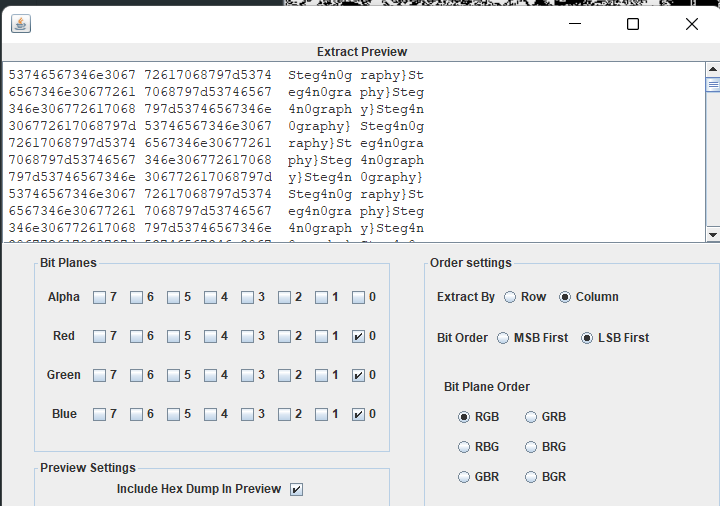

flag：hgame{ez_1mg_Steg4n0graphy}


# WEB

## Level Week1

### 蛛蛛...嘿嘿♥我的蛛蛛

两种做法，第一种是纯手动，点个100次就ok了

第二种是脚本跑，观察特点，除第一关外每关的url都是?key=xxx，那么就可以以此为特征，自动去跑

```python
'''
Author: KonDream
Date: 2022-01-21 00:11:01
LastEditors:  KonDream
LastEditTime: 2022-01-21 11:18:17
Description:  
'''
import requests
import re
import time
url = 'https://hgame-spider.vidar.club/b27155dafd?'

payload = url

for i in range(100):
    r = requests.get(url=payload)
    tmp = re.findall(r'key=.*?"', r.text)[0]
    tmp = tmp[0 : len(tmp) - 1]
    payload = url + tmp
    if i == 99:
        r = requests.get(url=payload)
        print(r.headers['Fi4g'])
        break
# 藏在响应包里
# hgame{4b2c5ac77c15c6f3f5fa4b5ed4f1f74d1779d64461ea62fbb46db5757e3a3ed3}
```

### Tetris plus

小游戏，让超过3k分能拿到flag，那么直接看看前端代码

在checking.js中发现了不同


可见当超过3k分时会alert一串东西，看看是啥


看来预期解就是要看代码的，不会真的有人玩到3k分吧

注释那一串是jsfuck，直接在控制台打印就行


hgame{jsfuck_1s_S0_fUu1n}

### Fujiwara Tofu Shop

思路有点绕，刚开始剑走偏锋了

抓包

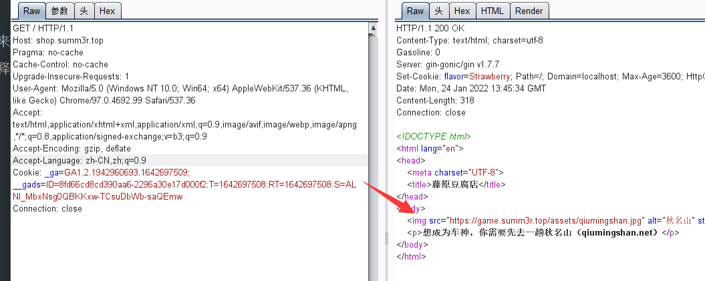

看到hint，添加referer字段：referer: qiumingshan.net

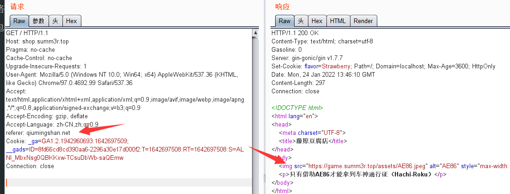

修改UA：User-Agent: Hachi-Roku

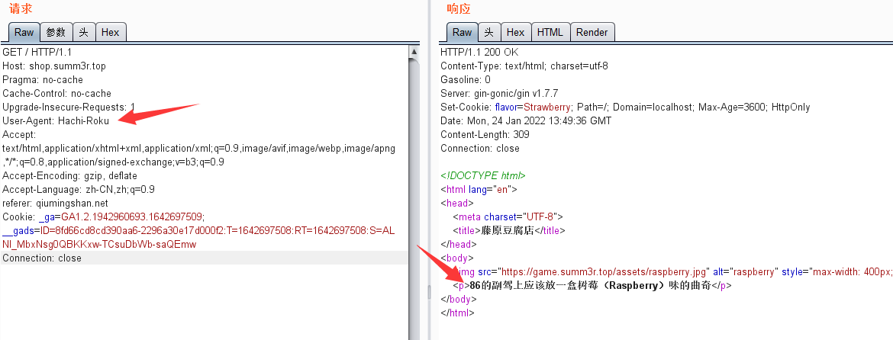

根据cookie提示，添加cookie：flavor=Raspberry

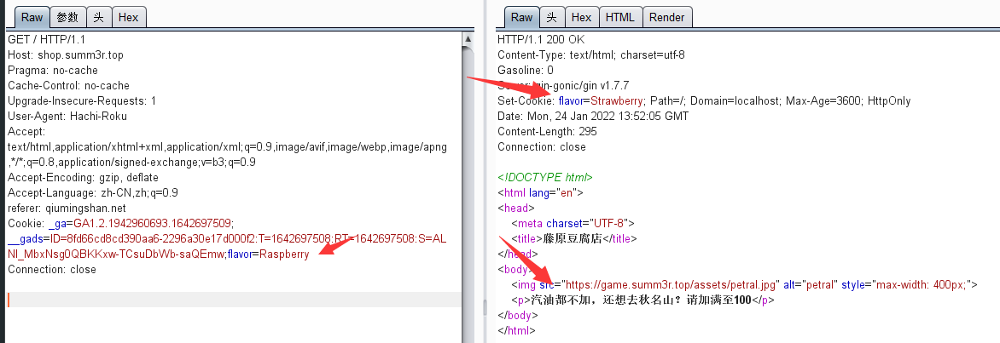

加个汽油：gasoline:100

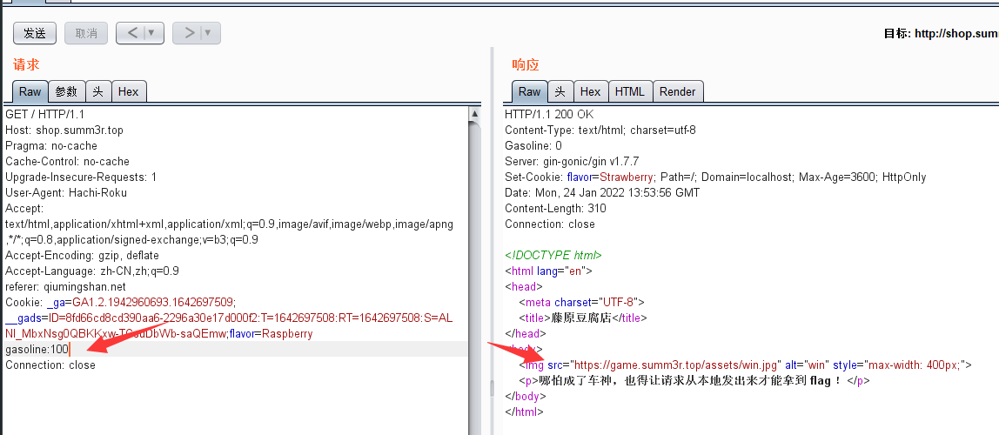

本地访问

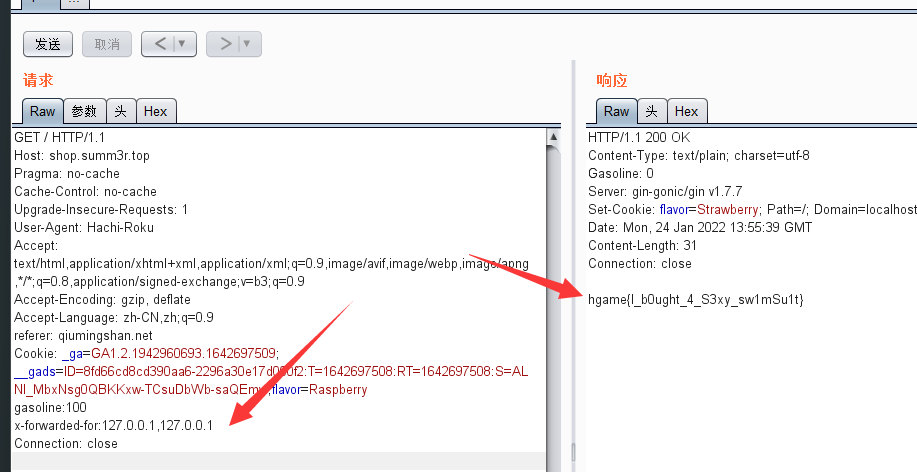

最终poc：

```http
GET / HTTP/1.1
Host: shop.summ3r.top
Pragma: no-cache
Cache-Control: no-cache
Upgrade-Insecure-Requests: 1
User-Agent: Hachi-Roku
Accept: text/html,application/xhtml+xml,application/xml;q=0.9,image/avif,image/webp,image/apng,*/*;q=0.8,application/signed-exchange;v=b3;q=0.9
Accept-Encoding: gzip, deflate
Accept-Language: zh-CN,zh;q=0.9
referer: qiumingshan.net
Cookie: _ga=GA1.2.1942960693.1642697509; __gads=ID=8fd66cd8cd390aa6-2296a30e17d000f2:T=1642697508:RT=1642697508:S=ALNI_MbxNsg0QBKKxw-TCsuDbWb-saQEmw;flavor=Raspberry
gasoline:100
x-forwarded-for:127.0.0.1,127.0.0.1
Connection: close

# hgame{I_b0ught_4_S3xy_sw1mSu1t}
```

### easy_auth(jwt)

随意注册个账户，抓返回包

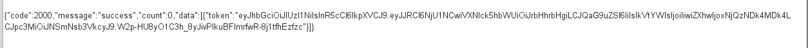

看到token是jwt，拿去解码，发现有密钥

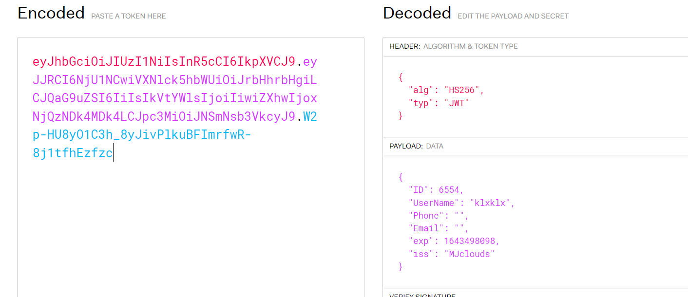

爆破得到密钥为空

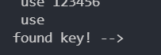

带着密钥，修改用户名和id

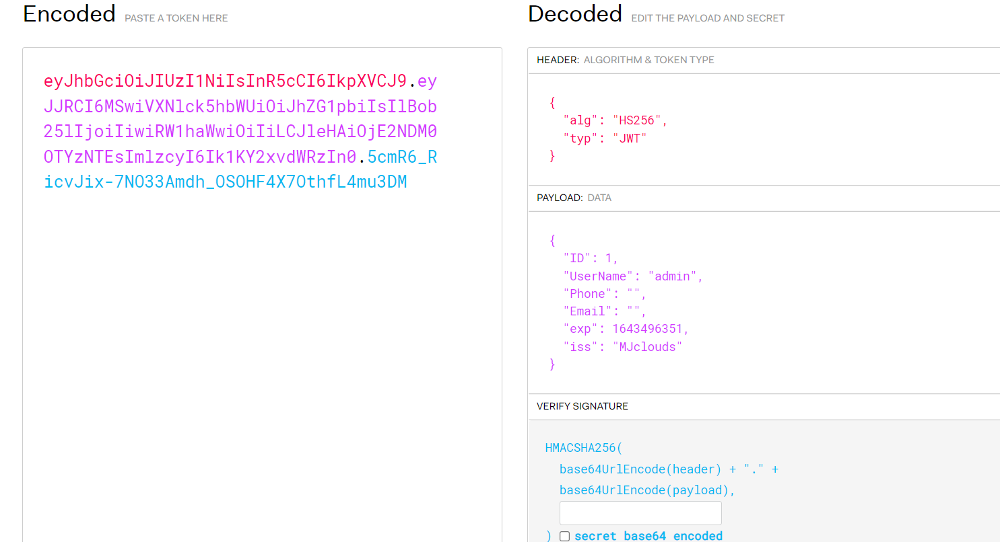

将得到的jwt放入token中放包

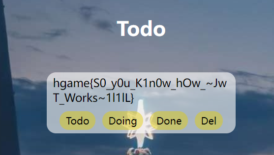

即以管理员身份登录，拿到flag
