## 写在前面

练练png隐写

——KonDream 2022年3月1日07:01:52

## One PieNG 1

文件名就是答案

#St4rt_fr0m_th1s_5tr1ng#

## One PieNG 2

图片上的文字就是

#Th1s_i5_s0_34sy!!!#

## One PieNG 3

图片高度改到1500，就出了，真实高度爆破出来是1463

#Pn9_He1gh7_6e_ch4ng3d#

## One PieNG 4

继续改高度，改为8000

#M4yb3_we_sh0uld_9o_d33per#

## One PieNG 5

通道隐写

#You_st3gs0lved_me!!!#

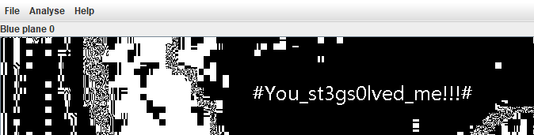

## One PieNG 6

LSB隐写

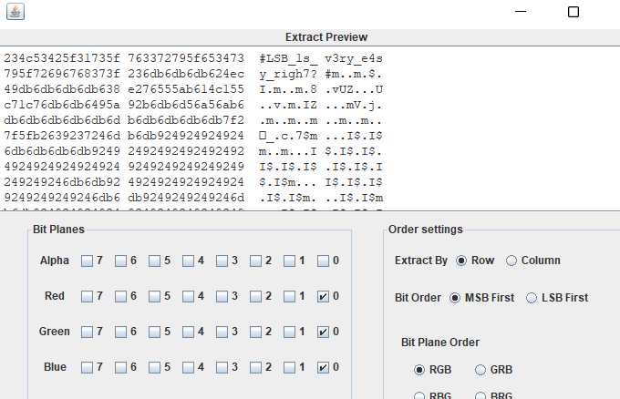

#LSB_1s_v3ry_e4sy_righ7?#

## One PieNG 7

LSB

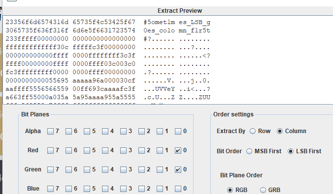

#5omet1mes_LSB_g0es_co1omn_f1r5t#

## One PieNG 8

LSB

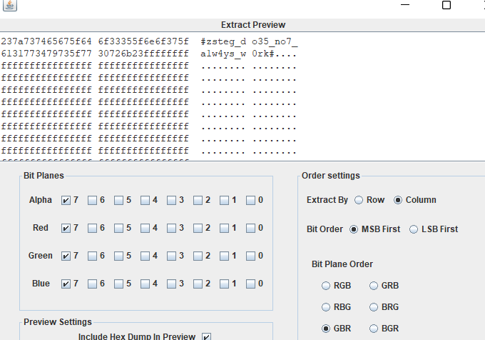

\#zsteg_do35_no7_a1w4ys_w0rk#

## One PieNG 9

LSB

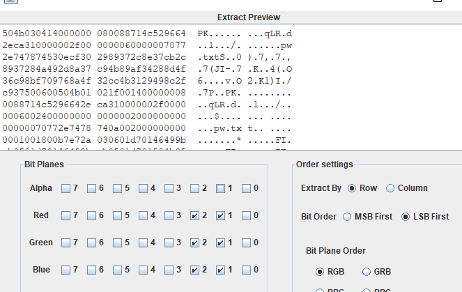

一个压缩包

#Wh4t_1s_6it_0rder_4nd_y0u_c4n_LSB_b1nd4ta_to0#

## One PieNG 10

在图片的exif字段中

#A_k3y_1n_exif#

## One PieNG 11

文件信息中

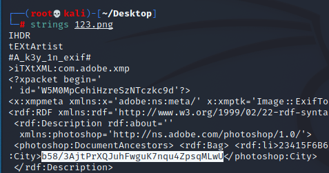

base58

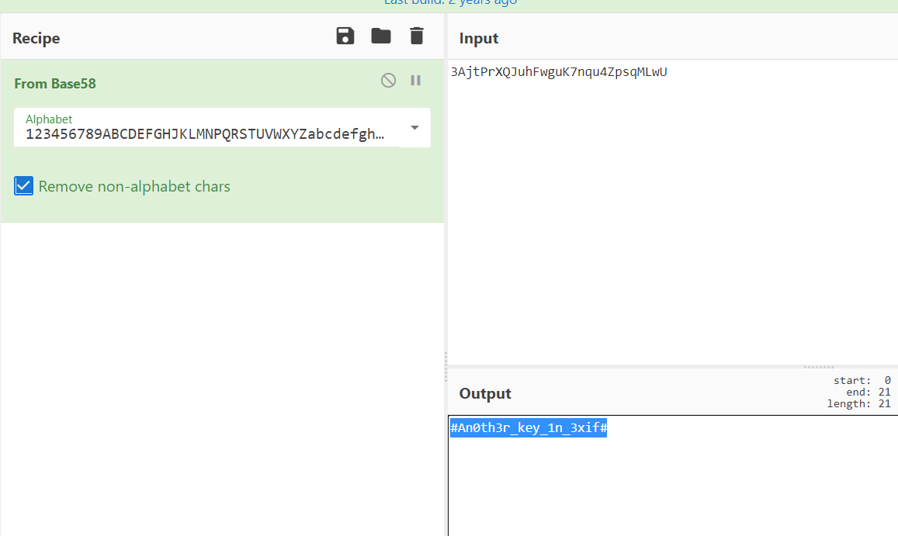

#An0th3r_key_1n_3xif#

## One PieNG 12

在文件信息中

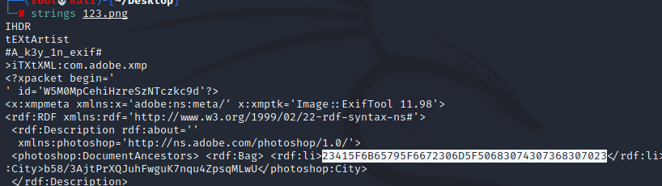

16进制转字符串

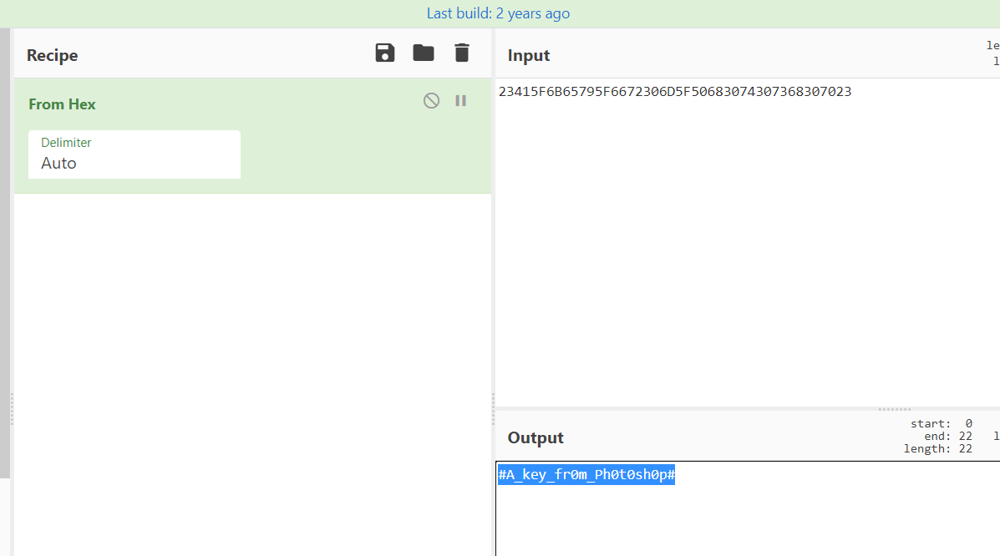

#A_key_fr0m_Ph0t0sh0p#

## One PieNG 13

也是藏在了一个块中

#Ju5t_a_1one1y_tEXt_chunk#

## One PieNG 14

IDAT信息有误，删掉

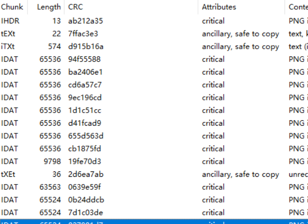

得到

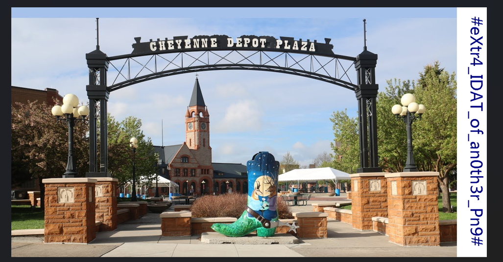

\#eXtr4_IDAT_of_an0th3r_Pn9#

## One PieNG 15

藏在IDAT中，zlib解压出来就是

#IDAT_i5_a_z1ib_p4cka9e#

## One PieNG 16

在14中删掉的IDAT块中，将错误CRC提取出来然后16进制转字符

#H1de_h3xd47a_1n_chunk_CRC#

## One PieNG 17

16进制翻翻就有了

#HexEditor_wi11_b3_he1pfu1#

## One PieNG 18

两张图片，foremost一下就出了

#He110_I_4m_Tw0_PieNG#

