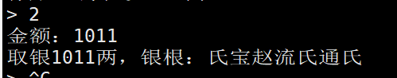

## 写在前面

2月卷王杯，web拿了1个一血，1个二血

——KonDream 2022年2月27日02:59:29

## 犯罪高手_签到

好玩好玩好玩，这题脑洞太大了，之前卡了一天没出，刚刚灵光乍现十分钟就出，牛批

连进去看看

什么嘛，初始身上就100两，买flag远远不够啊

诶，可以存钱，存钱试试

问题来了，银根是啥，开始卡住

~~开始思路是这银根类似于人民币上那一串号码，难道说让我找日升昌银行票号的银根？？好像逻辑很强啊，开始找，翻各种资料查博物馆，几个小时一无所获，他乃乃的！！不做了，打会SUSCTF Orz~~

焯，**谨记利用题目中的一切信息**，这还有个取钱呢，wtf！！试试

？？这就是银根？那理论上说用这个银根就可以存钱吧，试试就逝世

果然！！再存一次呢！！

可恶啊，不让存了，重开环境继续搞

果然，服务端根据输入判断的规则是一致的，新开的环境一点不影响，以下是反复刷钱得到的银根例子

可以看到无论是什么金额，中间有几个汉字是一成不变的，这几个字就是国-宝-流-通，牛批不，不愧是银行啊，然后其他数字0-9各代表一个汉字，那如果想要存到99999，9代表的数字是传，那银根就是**传国传宝传流传通传**

这就有钱了，flag？买！