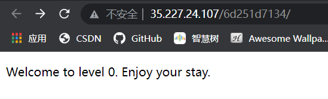
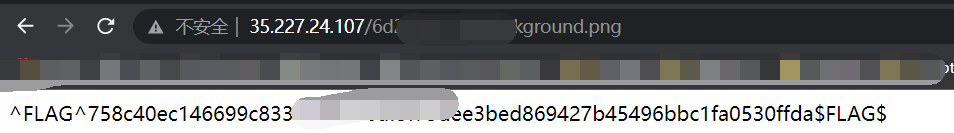
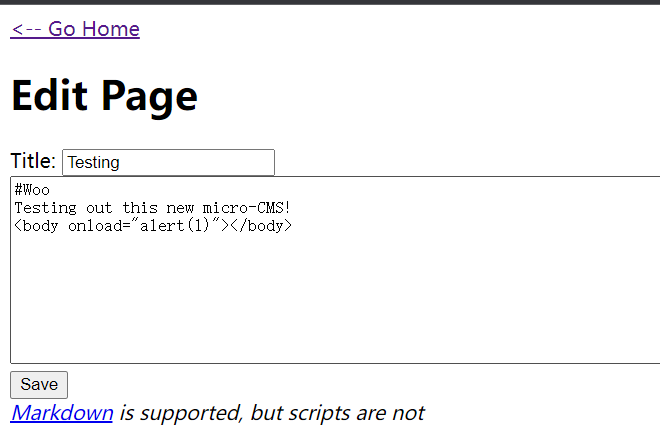
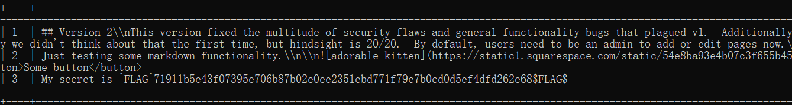
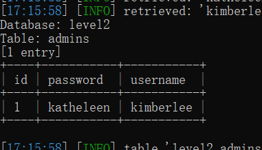
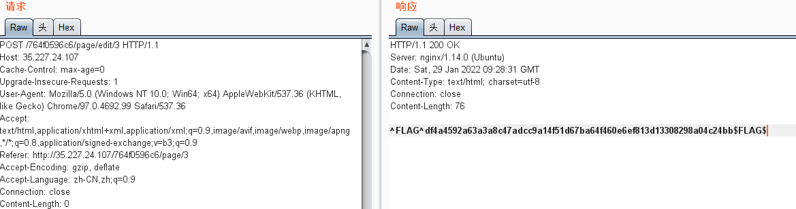

## 写在前面

偶然机会在某处看到说这个平台做题能得到私人的渗透邀请，我也来试试水：https://ctf.hacker101.com/ctf

——KonDream 2022年1月29日16:48:00

## Trivial (1 / flag)

来到界面



查看源码发现

```html
<!doctype html>
<html>
	<head>
		<style>
			body {
				background-image: url("background.png");
			}
		</style>
	</head>
	<body>
		<p>Welcome to level 0.  Enjoy your stay.</p>
	</body>
</html>
```

访问图片，得到flag



## Easy (2 / flag)

这题有4个flag

### flag1



随便来到一个页面进行编辑，发现下面过滤了script标签，猜测是xss，换个xss姿势，保存后查看源码拿到1个flag

### flag2

在标题框内进行xss，返回首页拿到第2个flag

### flag3

编辑框内：xxx/page/edit/6

因为新增页面时发现是从page9开始的，逐一访问前面的页面，发现只有page6是不可读的，所以从编辑页面入手

### flag4

注入之类的：xxx/page/edit/3'

## Moderate (3 / flag)

三个flag

### flag1

考察sql注入，直接sqlmap



### flag2

根据sqlmap拿到管理员账号密码



登录即可拿到第二个flag

### flag3

尝试使用万能密码登录，password：123，username：123' union select 123'

登录成功后出现隐藏页面，访问后发现是flag1，然后抓包改post，去掉cookie拿到flag



## 

