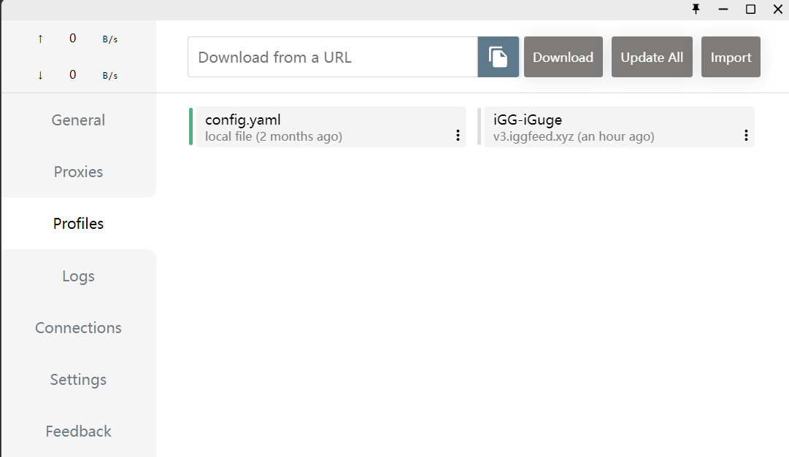
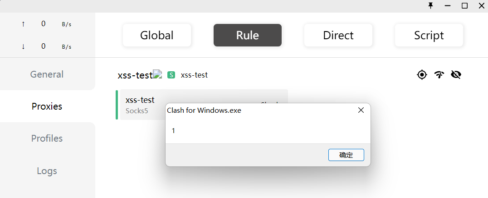
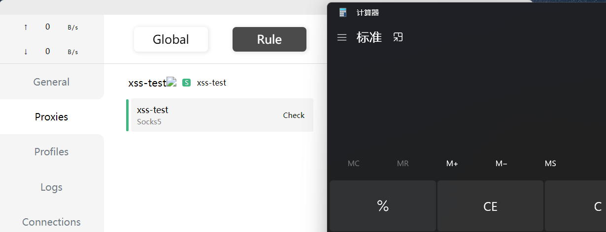
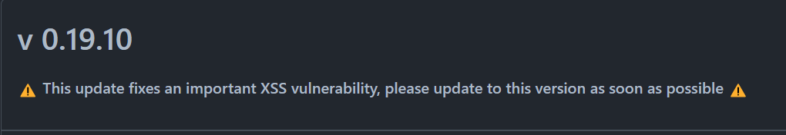

### 前言

Clash for Windows(以下简称CFW)是一款基于go语言开发的代理客户端，2月23日poc在github上公开，2月25日作者发布了修复版本。

### 漏洞影响版本

<= 0.19.9

### 一些思考

​	为什么说是从 xss 到 RCE ？在常规的漏洞挖掘中，利用较多的就是存储型xss，攻击者可以盗取一些信息比如网站拥有者的cookie，并进一步结合其他信息扩大攻击成果，仿佛很少能直接做到RCE，但是CFW为什么会被R呢？

​	反观CFW的设计模式，它是基于 Electron 框架开发而来的，而 Electron 是一个用 HTML、CSS 和 js 来构建跨平台桌面应用程序的一个开源库，这一点上和浏览器上的网页模式相同，在防护不到位的情况下就存在 XSS 漏洞的风险，从而执行任意js代码。CFW又与浏览器不同的是，CFW可以对主机本地文件进行读写操作，也可以调用一些系统函数，导致漏洞的危害性进一步扩大。

​	那CFW是如何产生 xss 的呢？在配置项中，可以看到存在一些yml文件，这些文件一定是经过了某种规则的渲染进而呈现在这个页面上，这里不妨看一下文件结构



```yaml
proxy-groups:
  - name: 🔰 节点选择
    type: select
    proxies:
      - ♻️ 自动选择
      - 🎯 全球直连
      - HK - 香港IEPL专线 - 01
```


可以看到这里的 name 和 proxies 属性都会在页面上进行渲染，不妨跟踪一下渲染规则

```js
e._l(e.conf["proxy-groups"], (function(t, n) {
	return i("div", {
		key: n,
		staticClass: "proxy-item left-item",
		on: {
			click: function(i) {
				return e.editGroup(t, n)
			}
		}
	},
	[i("div", {
		domProps: {
			innerHTML: e._s(e.$parseEmoji(t.name))
		}
	})
```

第13行 name 属性经过解析表情函数 parseEmoji 处理后，被直接插入到HTML中，从而造成了 XSS 漏洞

不妨验证一下，编写poc如下：

```yaml
port: 7890
socks-port: 7891
allow-lan: true
mode: Rule
log-level: info
external-controller: :9090
proxies:
  - name: xss-test
    type: socks5
    server: 127.0.0.1
    port: "17938"
    skip-cert-verify: true
  - name: abc
    type: socks5
    server: 127.0.0.1
    port: "8088"
    skip-cert-verify: true

proxy-groups:
  -
    name: xss-test
    type: select
    proxies:
    - xss-test
```



成功弹窗

### 漏洞复现

环境：win11 CFW：v0.18.4

在上面 xss 的基础上调用系统命令即可

POC：

```yaml
port: 7890
socks-port: 7891
allow-lan: true
mode: Rule
log-level: info
external-controller: :9090
proxies:
  - name: xss-test
    type: socks5
    server: 127.0.0.1
    port: "17938"
    skip-cert-verify: true
  - name: abc
    type: socks5
    server: 127.0.0.1
    port: "8088"
    skip-cert-verify: true

proxy-groups:
  -
    name: xss-test
    type: select
    proxies:
    - xss-test
```



### 漏洞危害

​	这样一个漏洞想要触发，现在我觉得是有点困难的，因为配置文件需手动导入或修改，这个漏洞爆出来后懂的人看一下就会知道有没有漏洞存在了，但不排除之前的在野利用，毕竟影响版本太广了，在不知情的情况下被上线了也是有可能的hhh，目前作者已经更新至v0.19.11，在新版本中，不再采用 innerHTML 属性。


