## 写在前面

发现了一个貌似很好玩的靶场，前来试试水：https://monyer.com/game/game1/

——KonDream 2022年1月26日02:43:50

## 入口关

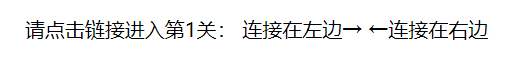

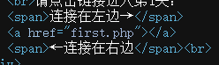

查看源代码后得到第1关入口：first.php

## 第1关

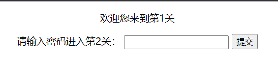

查看源代码，发现关键函数

```html
<script type="text/javascript">
    function check(){
        if(document.getElementById('txt').value=="  "){
            window.location.href="hello.php";
        }else{
            alert("密码错误");
        }
    }
</script>
```

原来是前端校验，得到第2关入口：hello.php

## 第2关

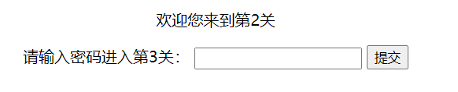

禁用了右键，ctrl+u快捷键查看源代码

```javascript
var a,b,c,d,e,f,g;
a = 3.14;
b = a * 2;
c = a + b;
d = c / b + a;
e = c - d * b + a;
f = e + d /c -b * a;
g = f * e - d + c * b + a;
a = g * g;
a = Math.floor(a);

function check(){
    if(document.getElementById("txt").value==a){
        window.location.href=a + ".php";
    }else{
        alert("密码错误");
        return false;
    }
}
```

看样子要解a，直接拿控制台跑一下

```javascript
var a,b,c,d,e,f,g;
a = 3.14;
b = a * 2;
c = a + b;
d = c / b + a;
e = c - d * b + a;
f = e + d /c -b * a;
g = f * e - d + c * b + a;
a = g * g;
a = Math.floor(a);
console.log(a)
```

/image-20220126025432262.png)

得到第3关入口：424178.php

## 第3关

/image-20220126025507685.png)

关键代码

```javascript
eval(String.fromCharCode(102,117,110,99,116,105,111,110,32,99,104,101,99,107,40,41,123,13,10,09,118,97,114,32,97,32,61,32,39,100,52,103,39,59,13,10,09,105,102,40,100,111,99,117,109,101,110,116,46,103,101,116,69,108,101,109,101,110,116,66,121,73,100,40,39,116,120,116,39,41,46,118,97,108,117,101,61,61,97,41,123,13,10,09,09,119,105,110,100,111,119,46,108,111,99,97,116,105,111,110,46,104,114,101,102,61,97,43,34,46,112,104,112,34,59,13,10,09,125,101,108,115,101,123,13,10,09,09,97,108,101,114,116,40,34,23494,30721,38169,35823,34,41,59,13,10,09,125,13,10,125));
```

明显ASCII码，转一下

```javascript
function check(){
    var a = 'd4g';
    if(docuэnt.getEleэntById('txt').value==a){
    	window.location.href=a+".php";
    }else{
    	alert("密码错误");
    }
}
```


得到第4关入口：d4g.php

## 第4关

访问时会302跳转，这里抓包看一下返回内容

```html
<!DOCTYPE HTML>
<html>
  <head>
    <meta http-equiv="content-type" content="text/html; charset=UTF-8">
    <meta name="robots" content="noindex,nofollow">
    <meta http-equiv="refresh" content="0;url=424178.php">
    <title>/Monyer——Monyer's Game(第4关)</title>
    <script type="text/javascript">eval(function(p,a,c,k,e,d){e=function(c){return c.toString(36)};if(!''.replace(/^/,String)){while(c--)d[c.toString(a)]=k[c]||c.toString(a);k=[function(e){return d[e]}];e=function(){return'\\w+'};c=1};while(c--)if(k[c])p=p.replace(new RegExp('\\b'+e(c)+'\\b','g'),k[c]);return p}('a="e";d c(){b(9.8(\'7\').6==a){5.4.3=a+".2"}1{0("密码错误")}}',15,15,'alert|else|php|href|location|window|value|txt|getElementById|document||if|check|function|3bhe'.split('|'),0,{}))</script>
  </head>
  <body>
    <div align="center">
      <p>4</p>
      <p>5
        <input type="text" id="txt" value="">
        <input type="button" onClick="check()" value="提交">
      </p>
    </div>
  </body>
  <script type="text/javascript">eval("\141\75\141\56\164\157\125\160\160\145\162\103\141\163\145\50\51\53\61\73");</script>
</html>
```


得到关键函数

```javascript
eval(function(p, a, c, k, e, d) {
    e = function(c) {
        return c.toString(36)
    };
    if (!''.replace(/^/, String)) {
        while (c--) d[c.toString(a)] = k[c] || c.toString(a);
        k = [function(e) {
            return d[e]
        }];
        e = function() {
            return '\\w+'
        };
        c = 1
    };
    while (c--) if (k[c]) p = p.replace(new RegExp('\\b' + e(c) + '\\b', 'g'), k[c]);
    return p
} ('a="e";d c(){b(9.8(\'7\').6==a){5.4.3=a+".2"}1{0("密码错误")}}', 15, 15, 'alert|else|php|href|location|window|value|txt|getElementById|document||if|check|function|3bhe'.split('|'), 0, {}))
```

说实话，有点乱，控制台运行一下

/image-20220126031521415.png)

得到3bhe，还有个函数

```javascript
eval("\141\75\141\56\164\157\125\160\160\145\162\103\141\163\145\50\51\53\61\73");
//a=a.toUpperCase()+1;
```

看来是转大写然后加1了，得到第5关入口：3BHE1.php

## 第5关

/image-20220126031846035.png)

看下标头

/image-20220126032005978.png)

得到第6关入口：asdf.php

## 第6关

/image-20220126032054009.png)

代码中有这样一行提示

```html
 <p></p>
```

看来图片中唯一有用的信息就是那句话了，google一下得到出处


结合图片下面的magazine，看来被遮挡的部分就是seventeen了，输入seventeen，得到第7关入口seventeen7.php

## 第7关

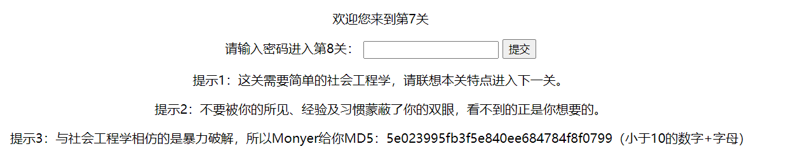

其实可以想到，第7关入口是seventeen7，那么第8关就是eighteen8，下面的md5也验证了这点

第8关入口：eighteen8.php

## 第8关

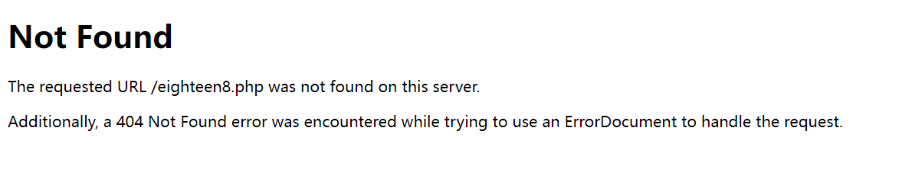

出题人坏坏哦，上一关说不要被所见、经验及习惯蒙蔽了你的双眼，看不到的正是你想要的。所以这不是简单的404，看看源码

```html

<!DOCTYPE HTML>
<html>
<head>
<meta http-equiv="content-type" content="text/html; charset=UTF-8">
<meta name="robots" content="noindex,nofollow">
<title>第8关</title>
</head>
<body>
    <h1>Not Found</h1>
    <p>The requested URL /eighteen8.php was not found on this server.</p>
    <p>Additionally, a 404 Not Found
        error was encountered while trying to use an ErrorDocument to handle the request.</p>
    <p style="display:none">
    第8关

    朋友您好，第8关欢迎您！
    我对您的聪明才智感到惊讶！
    相信我，现在世界上85%以上的人都在你之下，
    所以你可以大步向前，义无反顾地进行你的事业了。
    因为只要你肯努力，不畏惧挫折，这个世界上没有难倒你的事。


    那么继续我们的约定，我将告诉你第9关的入口：

    10000以内所有质数和.php
    </p>
</body>
</html>

```

果不其然，然后算质数吧

```python
'''
Author: KonDream
Date: 2022-01-26 02:57:09
LastEditors:  KonDream
LastEditTime: 2022-01-26 13:30:19
Description:  
'''

def judge(x):
    for i in range(2, x // 2 + 1):
        if x % i == 0:
            return False
    return True

ans = 0
for i in range(2, 10000):
    if judge(i):
        ans += i

print(ans)
```

得到第9关入口：5736396.php

## 第9关


哇哦，漂亮姐姐！记事本打开图片得到

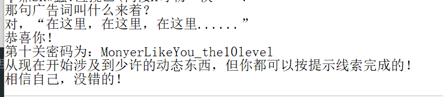

得到第10关入口：MonyerLikeYou_the10level.php

## 第10关

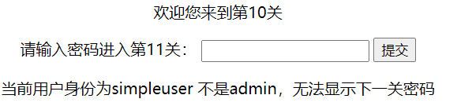

查看cookie

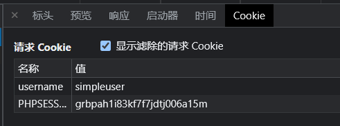

改为admin，得到下一关密码：doyouknow

第11关入口：doyouknow.php

## 第11关

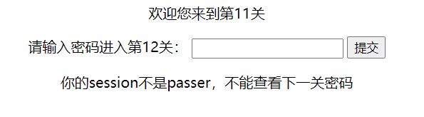

session存储在服务端，所以需要判断客户端的请求，将url改为doyouknow.php?action=show_login_true

得到第12关入口：smartboy.php

## 第12关

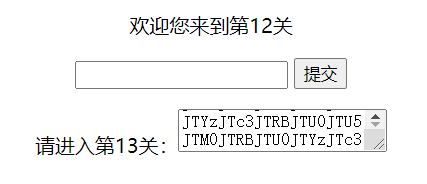

将这一堆字符解码，base64->urldecode->base64->urldecode

最终得到sobeautiful.php，但是直接访问不行，需要增加referer字段：referer:https://monyer.com/game/game1/sobeautiful.php

## 第13关

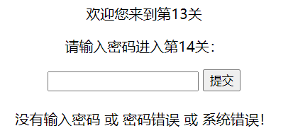

查看源代码发现是sql注入，直接万能密码：'or 1=1--+

得到第14关入口：whatyouneverknow.php

## 第14关

脱壳就行了，得到第15关入口：ipasscrackme.php

## 第15关

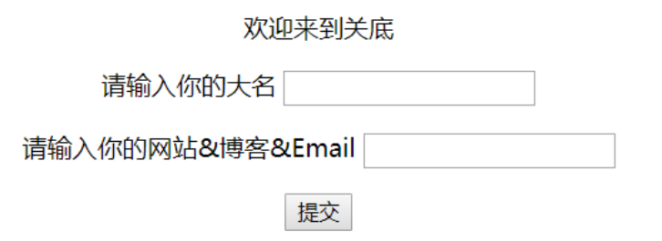

通关

## 写在最后

十几年前的东西，现在看算是ctf入门东西了，挺有意思

——KonDream 2022年1月26日14:07:36
